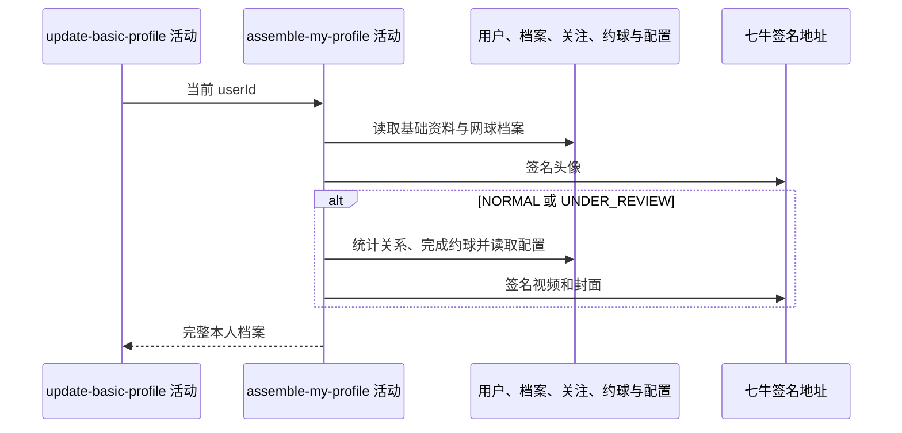

## 概要

重新读取本人档案，组装基础资料、统计、等级、评分和视频结果。

## 时序图

## 触发条件

上游基础资料保存后、同一事务提交前执行。

## 活动契约

入参为当前 `userId`；返回状态、基础用户资料，以及档案为 NORMAL/UNDER_REVIEW 时的统计、等级、评分和视频分组。

## 异常分支

| 错误标识 | 触发条件 | 处理 |
|---|---|---|
| `TOKEN_INVALID` | 重新读取不到当前用户 | 终止并回滚上游更新 |
| `SYSTEM_ERROR` | 城市、档案、统计、配置、资源签名或封面处理失败 | 终止并回滚上游更新 |

## 领域依赖

无

## 业务动作

A1 重新读取基础资料和网球档案并判定状态
A2 组装用户资料及头像签名地址
A3 对完整档案统计关系和完成约球
A4 计算等级提示与评分明细
A5 组装视频签名地址、封面与上传限制

## 详细流程

1. `A1` 用户不存在时报登录无效；无网球档案状态为 NONE，TBC 档案视不完整，NORMAL/UNDER_REVIEW 视完整。
2. `A2` 总是返回用户编号、昵称、性别、生日、城市、简介，并把头像键生成 3600 秒签名地址；非空城市编码用城市缓存取名称。
3. NONE/TBC 时 `stats/level/score/video` 全为 null；完整档案才执行后续读取。
4. `A3` 统计 follower/following，并按本人报名 `REVIEWED/SKIPPED` 且约球非 DRAFT 的口径统计完成约球。
5. `A4` 把 NTRP 保留一位小数；按冷却期与核查剩余场次决定提示及可修改性，并从配置读取评分权重、上限和说明计算综合等级。
6. `A5` 遍历档案视频，为每项生成一小时签名地址，把最后扩展名替换成 `.jpg` 作封面，空白标题显示“未命名”；读取数量、大小、时长上限配置。
7. 所有步骤只读；但任何异常向上传播，使调用本活动的更新事务回滚。七牛 RPC snapshot 当前缺失。

## 边界情况

- 保存了未知非空城市后，此处城市名解析可能失败并回滚更新。
- 完整档案的 NTRP 为 null 时一位小数转换失败。
- videos 为 null 或资源键无可替换扩展名时可能组装失败。
- 配置非法整数/小数按配置工具规则降级为 0，可能产生异常提示值。

## 实现提示

只读表列已按当前 DB snapshot 声明；返回组装依赖外部资源签名，写接口因此可能因读模型或签名故障回滚。
