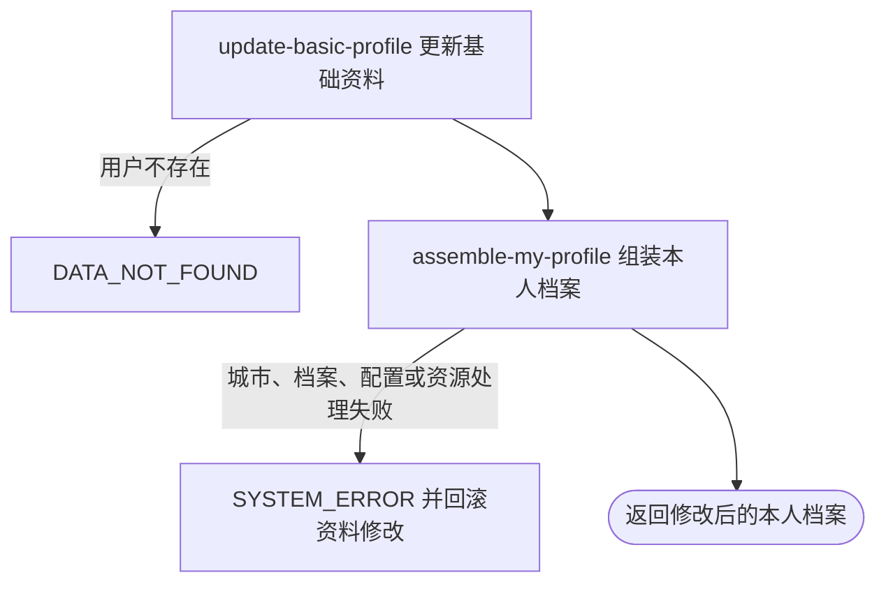

## 概要

部分更新当前用户的基础资料，并在同一事务中组装返回修改后的完整个人档案。

## 触发

登录用户编辑本人基础资料时发起。一次请求可提交一个或多个字段，也可提交空对象；接口在保存后立即返回与“我的档案”查询同范围的聚合结果，整个保存与组装过程处于同一事务。

## 接口契约

### 请求参数

| 字段 | 类型 | 必填 | 约束与空值语义 |
|---|---|---|---|
| `nickname` | 字符串 | 否 | `null` 保留原值；空串清空；无长度和内容校验 |
| `avatarUrl` | 字符串 | 否 | `null` 保留原值；空串清空；按七牛资源标识保存，不校验资源 |
| `gender` | 枚举 | 否 | `MALE`、`FEMALE`、`UNDISCLOSED`；`null` 保留原值 |
| `birthday` | 日期 | 否 | `yyyy-MM-dd` 可解析日期；`null` 保留原值，无法清除；无年龄和未来日期校验 |
| `cityCode` | 字符串 | 否 | `null` 保留原值；空串清空；保存前不校验城市存在或开放 |
| `bio` | 字符串 | 否 | `null` 保留原值；空串清空；无长度和内容校验 |

### 成功响应

返回本人聚合档案：

| 结果分组 | 返回条件 | 主要内容 |
|---|---|---|
| `status` | 始终 | `NONE`、`TBC`、`NORMAL` 或 `UNDER_REVIEW` |
| `user` | 始终 | 用户编号、昵称、头像签名地址、性别、生日、城市编码与名称、简介 |
| `stats` | `NORMAL`、`UNDER_REVIEW` | 粉丝数、关注数、已完成约球数 |
| `level` | `NORMAL`、`UNDER_REVIEW` | NTRP、提示文案、是否可修改 |
| `score` | `NORMAL`、`UNDER_REVIEW` | 综合评级及信誉分、可信度、校准度 |
| `video` | `NORMAL`、`UNDER_REVIEW` | 视频及封面签名地址、标题、数量与上传限制 |

头像和视频地址有效期固定为 3600 秒。`NONE` 与 `TBC` 的后四个网球档案分组为空。

## 业务活动

- update-basic-profile  按非空请求字段覆盖并保存当前用户的基础资料
- assemble-my-profile  重新读取本人档案，组装基础资料、统计、等级、评分和视频结果

## 流程图

## 详细流程

1. 识别当前登录用户，按用户编号读取基础资料；不存在时以“用户不存在”拒绝，不接受调用方指定其他用户。
2. 对昵称、头像资源标识、性别、生日、城市编码和个人简介逐字段处理：请求值非 `null` 才覆盖，`null` 保留原值；字符串空串会被保存为空。不做长度、内容、年龄、城市开放性或资源归属校验。
3. 再次读取现有用户记录并保存上述完整基础资料；空请求或全部字段为 `null` 仍执行保存并继续返回成功。
4. 在同一事务内重新读取本人基础资料与网球档案并判定状态。没有网球档案时为 `NONE`，状态为 `TBC` 时只交付基础资料；`NORMAL` 或 `UNDER_REVIEW` 继续组装统计、等级、评分和视频。
5. 基础资料结果把头像资源标识转换为一小时签名地址，并用非空城市编码查城市名；正常或核查期档案还统计关注、粉丝和已完成约球，计算等级提示与综合评级，并给每个视频生成签名地址和封面地址。
6. 返回聚合后的本人档案。聚合阶段的用户、城市、档案、关注、约球、配置或资源地址处理失败会抛出异常，使前面的基础资料保存随事务回滚。

## 异常分支

| 对外失败码 | 触发条件 | 由哪个活动报出 | 补偿动作或超时处理 | 对外提示 |
|---|---|---|---|---|
| 请求解析失败 | 请求体缺失或无法解析，日期格式错误，性别枚举无法识别 | 流程 | 不读取或保存用户 | 按框架请求错误或系统异常返回 |
| `DATA_NOT_FOUND` | 当前登录身份没有对应用户记录 | update-basic-profile | 不修改任何资料 | 用户不存在 |
| `SYSTEM_ERROR` | 用户保存失败或字段超过数据库限制 | update-basic-profile | 事务回滚本次用户更新 | 系统异常，请稍后重试 |
| `SYSTEM_ERROR` | 非空城市编码不在城市缓存，档案状态或视频数据无法转换，统计与配置读取失败 | assemble-my-profile | 事务回滚已保存的基础资料 | 系统异常，请稍后重试 |
| `SYSTEM_ERROR` | 七牛签名配置或构址失败，视频资源标识没有可替换的扩展名 | assemble-my-profile | 事务回滚已保存的基础资料 | 系统异常，请稍后重试 |

空对象、全部字段为 `null`、字符串空串、未来生日、未开放城市和未经归属校验的头像资源不会在保存活动中触发业务拒绝。未知非空城市只会在后续组装城市名称时失败并导致回滚。

## 技术线索

- HTTP 接口：`PUT /user/profile`
- 事务入口：`ProfileAppService.editUser`
- 字段合并：MapStruct `NullValuePropertyMappingStrategy.IGNORE`
- 用户定位：始终取 `UserContext`，请求不含目标用户编号
- 用户保存：读取 `user` 记录后 `updateById`
- 返回聚合：同步调用 `MyProfileAppService.getMyProfile`
- 档案内容门槛：`hasProfile` 只对 `NORMAL`、`UNDER_REVIEW` 为真
- 城市名称：`CityConfig.getCityName`
- 资源地址：七牛签名 URL 固定 3600 秒；视频封面把最后一个扩展名替换为 `.jpg`
- 配置解析：整数或小数的异常值按配置工具规则降级为 `0`
