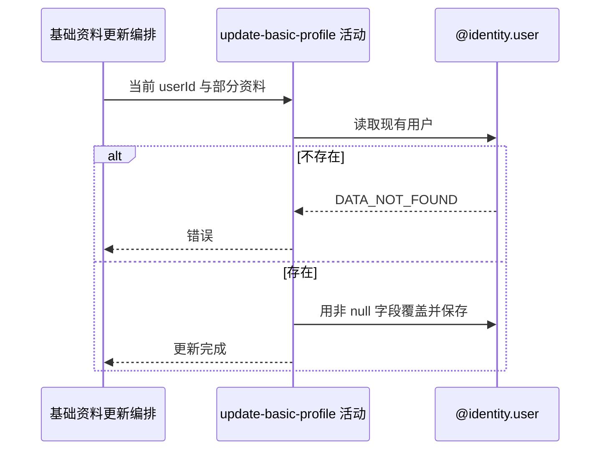

## 概要

按非空请求字段覆盖并保存当前用户的基础资料。

## 时序图

## 触发条件

已登录用户提交可解析的 JSON 对象后执行；允许空对象和全部字段为 null。

## 活动契约

入参为当前 `userId`，以及可选昵称、头像键、性别、生日、城市编码、简介；null 保留旧值，字符串空串作为有效新值保存。成功无中间业务返回。

## 异常分支

| 错误标识 | 触发条件 | 来源 |
|---|---|---|
| `DATA_NOT_FOUND` | 当前用户记录不存在 | update-basic-profile 流程对应错误一行 |
| `SYSTEM_ERROR` | 用户保存、列容量或事务提交失败 | update-basic-profile 流程 `SYSTEM_ERROR` 一行 |

## 领域依赖

### @identity.user

- 输入：当前用户编号、现有资料与本次非空字段覆盖意图
- 输出：用户存在时保存合并后的基础资料；不存在或保存失败时返回相应结论

## 业务动作

A1 按当前身份读取用户资料
A2 合并请求中的非 null 字段
A3 保存完整基础资料

## 详细流程

1. `A1` 用户编号只来自登录上下文，请求不能指定其他用户；不存在报 `DATA_NOT_FOUND`。
2. `A2` MapStruct 忽略 null：昵称、头像键、性别、生日、城市和简介未提交时保持旧值。
3. 字符串空串不是 null，会清空对应字段；生日和性别不能通过 null 清除。
4. 不校验字符串长度/内容、未来生日、城市存在/开放、头像资源存在或归属。
5. `A3` 再按用户编号取得持久化记录并 `updateById`；空对象仍执行更新。
6. 本活动与下游完整档案组装同一事务，组装失败会回滚保存。

## 边界情况

- 空对象是一次无字段变化但仍写库的成功请求。
- 默认昵称头像、未知城市、空字符串与未来生日均可先保存。
- 超长字符串可能由数据库列约束报系统异常。
- 并发部分更新先各自读取全对象，后保存者可能覆盖先保存者的其他字段。

## 实现提示

部分更新当前是读-改-写整对象；高并发下若需字段级合并，应在仓储只更新请求明确提交的列。
