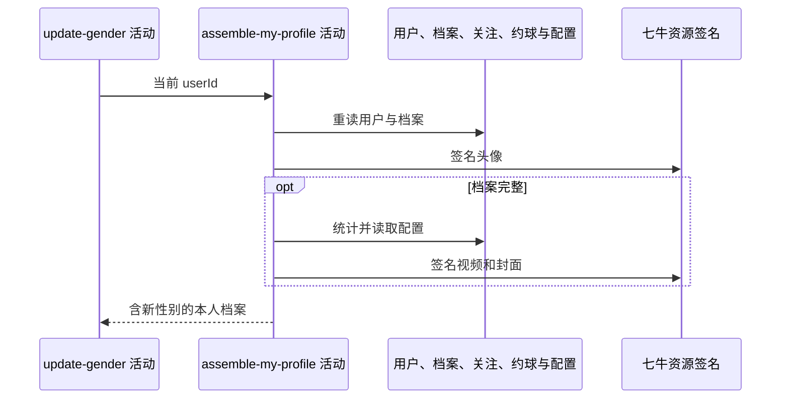

## 概要

重新读取并组装含新性别的本人聚合档案。

## 时序图

## 触发条件

上游性别保存后、同一事务提交前执行。

## 活动契约

入参为当前 `userId`；返回档案状态、含新性别的基础资料，以及完整档案时的统计、等级、评分和视频分组。

## 异常分支

| 错误标识 | 触发条件 | 处理 |
|---|---|---|
| `TOKEN_INVALID` | 重读用户不存在 | 终止并回滚性别 |
| `SYSTEM_ERROR` | 城市、统计、配置、档案或资源处理失败 | 终止并回滚性别 |

## 领域依赖

无

## 业务动作

A1 重读用户档案并判断完整性
A2 组装基础资料和头像签名
A3 完整档案时组装统计、等级与评分
A4 组装视频资源和上传限制

## 详细流程

1. 无档案为 NONE，TBC 为不完整，NORMAL/UNDER_REVIEW 为完整；基础 user 始终返回并包含新 gender。
2. 头像键转 3600 秒签名地址，非空城市编码解析名称；NONE/TBC 的 `stats/level/score/video` 为 null。
3. 完整档案统计关注、粉丝及本人 `REVIEWED/SKIPPED` 的非草稿完成约球。
4. NTRP、冷却与核查场次生成等级提示，配置驱动综合评分明细。
5. 视频逐项生成签名地址与 `.jpg` 封面，空标题降级“未命名”，并读取数量/大小/时长限制。
6. 活动只读；任一异常向上传播并回滚性别。七牛 RPC snapshot 当前缺失。

## 边界情况

- 未知城市、null NTRP、null videos 或无扩展名资源可导致失败。
- 配置非法值按工具降级为 0。
- 不完整档案不会读取统计和视频。
- 历史比分仍保留旧性别快照。

## 实现提示

只读表列已按当前 DB snapshot 声明；此读模型与其他个人档案入口保持同一组装口径。
