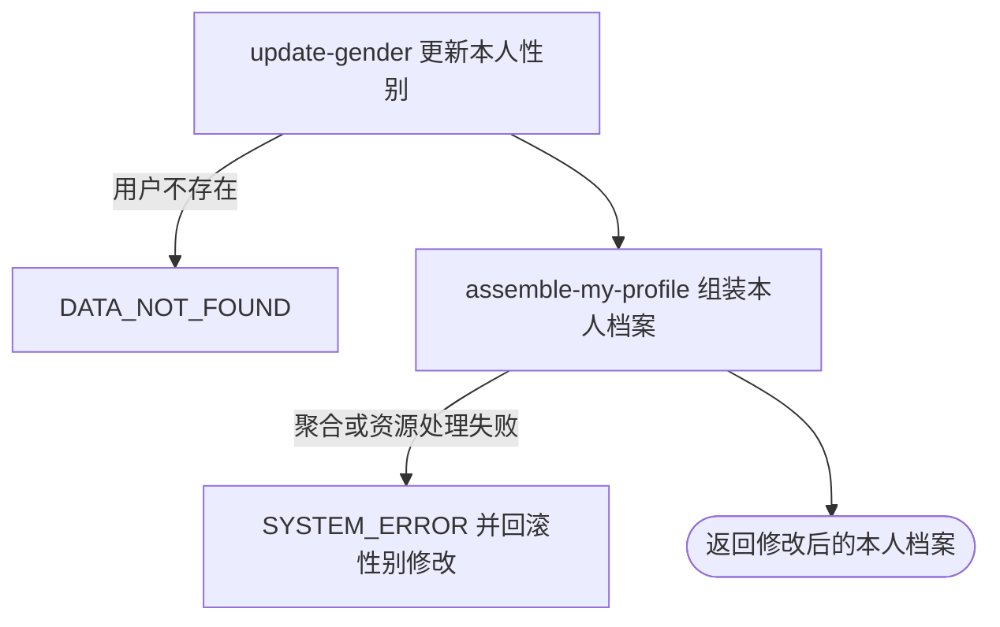

## 概要

更新当前用户的性别，并在同一事务中返回修改后的完整个人档案。

## 触发

登录用户通过独立入口修改本人性别时发起。一次请求必须提交一个有效枚举值；重复提交当前值也按成功处理，并立即返回与“我的档案”查询同范围的聚合结果。

## 接口契约

### 请求参数

| 字段 | 类型 | 必填 | 约束 |
|---|---|---|---|
| `gender` | 枚举 | 是 | `MALE`、`FEMALE` 或 `UNDISCLOSED`；不可为 `null` |

### 成功响应

返回本人聚合档案，始终包含档案状态和基础资料中的新性别。状态为 `NONE` 或 `TBC` 时，统计、等级、评分和视频为空；状态为 `NORMAL` 或 `UNDER_REVIEW` 时，还返回关注与约球统计、NTRP、评分及视频资料。资源地址为限时签名地址。

## 业务活动

- update-gender  覆盖并保存当前用户的性别
- assemble-my-profile  重新读取并组装含新性别的本人聚合档案

## 流程图

## 详细流程

1. 接收必填性别枚举并识别当前登录用户；只允许 `MALE`、`FEMALE`、`UNDISCLOSED`。
2. 按当前用户编号读取基础资料；不存在时以“用户不存在”拒绝。用请求值直接覆盖性别并保存，不限制原值、修改频次、档案状态或已有业务关系，重复提交同值也执行保存。
3. 在同一事务内重新读取本人基础资料与网球档案。没有档案时返回 `NONE`，`TBC` 时只返回基础资料；`NORMAL` 或 `UNDER_REVIEW` 时继续组装统计、NTRP、评分和视频。
4. 返回含新性别的聚合档案。城市、档案、关注、约球、配置或资源地址处理失败会抛出异常，使性别保存随事务回滚。
5. 不记录性别变更历史，不回写历史比分快照，也不重新审查已有约球、赛事或报名关系。

## 异常分支

| 对外失败码 | 触发条件 | 由哪个活动报出 | 补偿动作或超时处理 | 对外提示 |
|---|---|---|---|---|
| 请求校验失败 | `gender` 未提交或为 `null` | 流程 | 不读取或保存用户 | gender: 性别不能为空 |
| 请求解析失败 | `gender` 不是支持的枚举值或请求体无法解析 | 流程 | 不读取或保存用户 | 按框架请求错误或系统异常返回 |
| `DATA_NOT_FOUND` | 当前登录身份没有对应用户记录 | update-gender | 不修改性别 | 用户不存在 |
| `SYSTEM_ERROR` | 用户保存失败 | update-gender | 事务回滚性别修改 | 系统异常，请稍后重试 |
| `SYSTEM_ERROR` | 城市、档案、统计、配置、头像或视频资源处理失败 | assemble-my-profile | 事务回滚已保存的性别 | 系统异常，请稍后重试 |

提交当前性别、在任意档案状态下修改或已有参与关系都不是异常。服务不会因改为 `UNDISCLOSED` 而即时撤销性别受限业务中的既有关系。

## 技术线索

- HTTP 接口：`PUT /user/profile/gender`
- 请求校验：`UpdateGenderCmd.gender` 使用 `@NotNull`
- 事务入口：`ProfileAppService.updateGender`
- 用户定位：始终取 `UserContext`，请求不含目标用户编号
- 用户保存：读取 `user` 后设置 `gender` 并 `updateById`
- 返回聚合：同步调用 `MyProfileAppService.getMyProfile`
- 档案内容门槛：`hasProfile` 只对 `NORMAL`、`UNDER_REVIEW` 为真
- 无联动：不写性别变更日志，不更新历史比分快照或既有参与关系
