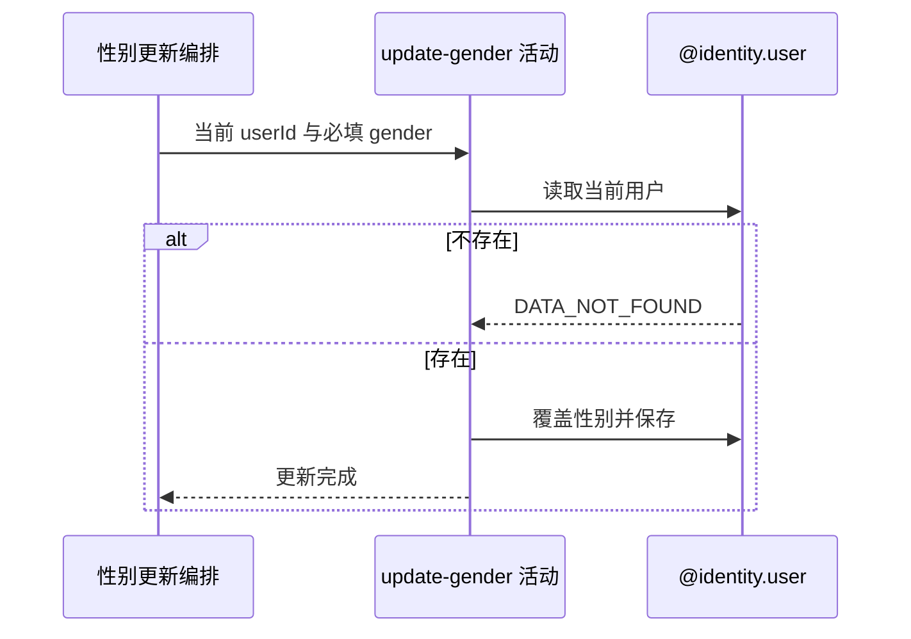

## 概要

覆盖并保存当前用户的性别。

## 时序图

## 触发条件

已登录用户提交可识别且非 null 的 `MALE/FEMALE/UNDISCLOSED` 后执行。

## 活动契约

入参为当前 `userId` 和必填 `gender`；成功无中间返回，用户性别已保存。

## 异常分支

| 错误标识 | 触发条件 | 来源 |
|---|---|---|
| `DATA_NOT_FOUND` | 当前用户不存在 | update-gender 流程对应错误一行 |
| `SYSTEM_ERROR` | 用户保存或事务提交失败 | update-gender 流程 `SYSTEM_ERROR` 一行 |

## 领域依赖

### @identity.user

- 输入：当前用户编号、新性别和覆盖保存意图
- 输出：存在时保存新性别；不存在或保存失败时返回相应结论

## 业务动作

A1 按登录身份读取用户
A2 直接覆盖性别并保存

## 详细流程

1. 用户编号只来自登录上下文，不能替他人修改；不存在报 `DATA_NOT_FOUND`。
2. 请求层拒绝 null 和未知枚举，活动接受三个枚举值，不限制原值、档案状态、频次或业务关系。
3. `A2` 直接 set gender 后全对象 `updateById`，重复提交当前值仍执行保存。
4. 不记录变更历史，不回写历史比分快照，也不重审已有约球、赛事或报名资格。
5. 与下游档案组装同事务，组装异常会回滚性别保存。

## 边界情况

- 改为 UNDISCLOSED 不撤销已加入的性别受限活动。
- 任意档案状态均可修改。
- 相同值重复提交成功。
- 并发性别更新以后提交值为准。

## 实现提示

若性别变更需要影响准入，只应约束未来行为；历史关系和变更审计需另行定义。
