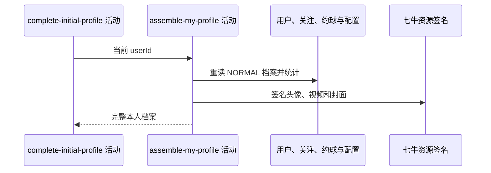

## 概要

重新读取并组装完成后的本人聚合档案。

## 时序图

## 触发条件

上游档案已置 NORMAL 并保存后、同一事务提交前执行。

## 活动契约

入参为当前 `userId`；返回 NORMAL 状态、基础资料、统计、等级、评分和完整视频分组。

## 异常分支

| 错误标识 | 触发条件 | 处理 |
|---|---|---|
| `TOKEN_INVALID` | 重读用户不存在 | 终止并回滚档案提交 |
| `SYSTEM_ERROR` | 城市、NTRP、视频、统计、配置或资源处理失败 | 终止并回滚档案提交 |

## 领域依赖

无

## 业务动作

A1 重读完成后的用户与档案
A2 组装基础资料、头像和城市
A3 统计关系与完成约球并计算等级评分
A4 组装视频资源与上传限制

## 详细流程

1. 上游已置 NORMAL，因此本次正常进入完整档案分支；状态与用户基础资料始终返回。
2. 头像转一小时签名地址，城市编码解析名称；统计关注/粉丝及 REVIEWED/SKIPPED 的非草稿完成约球。
3. NTRP 保留一位小数，冷却/核查标记决定提示和可修改性；配置驱动综合评级和三项评分。
4. 每个视频生成一小时签名地址与 `.jpg` 封面，空标题为“未命名”，并读取上传限制。
5. 所有步骤只读；异常向上传播并回滚上游档案保存。七牛 RPC snapshot 当前缺失。

## 边界情况

- 重提交后残留 isUnderReview 可使 NORMAL 档案仍展示核查期提示。
- 未知城市、异常 NTRP、null 视频或无扩展名 key 可失败。
- 超量视频全部返回，不按 maxCount 截断。
- 配置非法值按工具降级 0。

## 实现提示

只读表列已按当前 DB snapshot 声明；组装层应能容忍存量档案组合状态，避免写成功被展示异常回滚。
