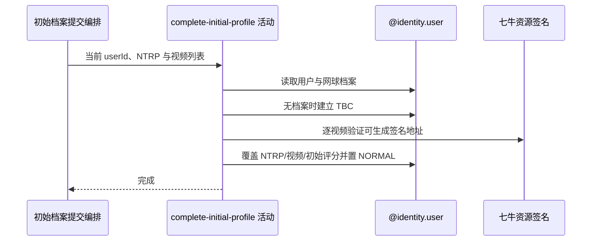

## 概要

必要时建立待完善档案，再用 NTRP、视频和初始评分配置完成或覆盖档案。

## 时序图

## 触发条件

已登录用户提交非 null NTRP 和至少一项视频后执行；不限当前档案状态。

## 活动契约

入参为当前 `userId`、必填 `ntrpScore/videos` 及当前忽略的可选 `gender/birthday`；成功无中间返回，档案状态为 NORMAL。

## 异常分支

| 错误标识 | 触发条件 | 来源 |
|---|---|---|
| `TOKEN_INVALID` | 当前用户不存在 | submit-initial-profile 流程对应错误一行 |
| `SYSTEM_ERROR` | null 视频项、资源签名、配置、序列化或档案保存失败 | submit-initial-profile 流程 `SYSTEM_ERROR` 一行 |

## 领域依赖

### @identity.user

- 输入：当前用户、NTRP、完整视频列表和完成/覆盖网球档案的意图
- 输出：必要时建立 TBC，再保存 NORMAL 档案及初始三项评分；用户不存在或保存失败时返回相应结论

## 业务动作

A1 读取用户和现有网球档案
A2 无档案时初始化 TBC
A3 预处理每项视频资源键
A4 覆盖 NTRP、视频、状态和初始评分并保存

## 详细流程

1. `A1-A2` 用户不存在报 TOKEN_INVALID；档案 NONE 时先建立 `userId/status=TBC/videos=[]`，已有 TBC/NORMAL/UNDER_REVIEW 均继续。
2. `A3` 逐项调用视频 key 的签名地址构建作预处理；空白 key 当前不一定拒绝，null 列表项会异常。不校验文件存在、归属、数量、大小、时长和标题。
3. `A4` 完整覆盖 `ntrpScore/videos`，状态置 NORMAL，并从配置重置 reputation/credibility/calibration 初始值；不校验 NTRP 范围、步长或精度。
4. 请求的 gender/birthday 完全忽略；不写 `ntrpUpdatedAt`。
5. 从 UNDER_REVIEW 重提时不清 `isUnderReview/reviewRemainingMatches`，可形成 NORMAL 状态与核查标记并存。
6. 保存用户聚合后进入同事务档案组装；组装失败会回滚初始化或覆盖，不上传、转码或删除资源。

## 边界情况

- 正常或核查期档案可重复提交并重置三项评分。
- 任意数据库可存 NTRP 都可能成功。
- 视频数量可超过展示上传限制。
- 空白 key 或标题可保存，返回时标题降级“未命名”。

## 实现提示

入口名不等于一次性初始化；如需禁止覆盖或清理核查状态，必须在 `@identity.user` 档案行为中明确规则。
