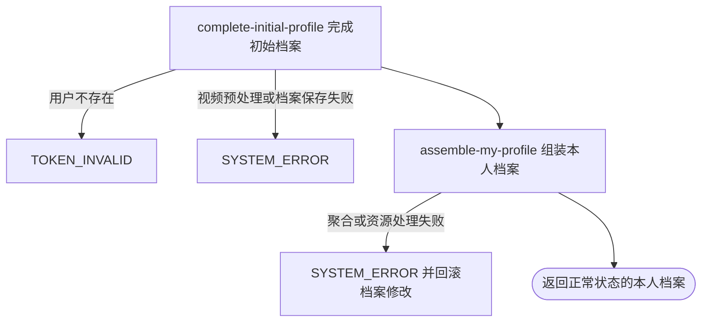

## 概要

提交或覆盖本人初始网球档案，并返回正常状态的聚合档案。

## 触发

登录用户在档案引导页提交 NTRP 自评和展示视频时发起。入口名称虽为初始提交，但无档案、待完善、正常和核查期档案都可调用；一次请求以完整列表覆盖视频并立即返回本人聚合档案。

## 接口契约

### 请求参数

| 字段 | 类型 | 必填 | 约束与实际用途 |
|---|---|---|---|
| `gender` | 字符串 | 否 | 当前实现完全忽略，不保存也不校验 |
| `birthday` | 日期 | 否 | 当前实现完全忽略；若提交仍需能按日期格式解析 |
| `ntrpScore` | 小数 | 是 | 不可为 `null`；无范围、正数、步长和精度业务校验 |
| `videos` | 数组 | 是 | 不可为 `null` 或空数组；不限制数量 |
| `videos[].key` | 字符串 | 否 | 可为空白；不核实文件、归属、大小和时长 |
| `videos[].title` | 字符串 | 否 | 可为空白；返回时空白标题展示为“未命名” |

### 成功响应

返回状态为 `NORMAL` 的本人聚合档案，包含基础资料、关注与约球统计、NTRP 与提示、综合评级与三项评分、完整视频列表和上传限制。头像、视频及封面地址为有效期 3600 秒的签名地址；响应不返回本次是否新建、覆盖前值或重置明细。

## 业务活动

- complete-initial-profile  必要时建立待完善档案，再用 NTRP、视频和初始评分配置完成或覆盖档案
- assemble-my-profile  重新读取并组装完成后的本人聚合档案

## 流程图

## 详细流程

1. 接收非空 NTRP 自评和至少一项视频，识别当前登录用户并读取基础资料与现有网球档案；用户不存在时按无效登录身份拒绝。
2. 没有网球档案时先在当前事务内建立 `TBC` 档案；已有 `TBC`、`NORMAL` 或 `UNDER_REVIEW` 档案也都允许继续，没有仅限首次提交的状态校验。
3. 遍历视频列表并尝试为每个视频资源标识生成签名地址；空资源标识不报错，`null` 列表项会异常。不检查文件存在、归属、数量上限、大小、时长或标题。
4. 用请求 NTRP 和完整视频列表覆盖档案，将状态设为 `NORMAL`，并把信誉分、可信度和校准度重置为当前初始配置值；请求中的性别和生日完全不保存，也不设置 NTRP 修改时间。
5. 从 `UNDER_REVIEW` 重复提交时不清除 `isUnderReview` 和剩余核查场次，因此可能形成状态为 `NORMAL` 但核查标记仍为真的组合。
6. 保存网球档案，再在同一事务内组装本人基础资料、统计、等级、评分和视频结果；头像、视频和封面生成一小时签名地址。
7. 返回完整聚合档案。保存后聚合失败会回滚本次新建或覆盖，不上传、转码或删除任何资源。

## 异常分支

| 对外失败码 | 触发条件 | 由哪个活动报出 | 补偿动作或超时处理 | 对外提示 |
|---|---|---|---|---|
| 请求校验失败 | `ntrpScore` 为 `null` | 流程 | 不建立或修改档案 | ntrpScore: NTRP 自评分不能为空 |
| 请求校验失败 | `videos` 为 `null` 或空数组 | 流程 | 不建立或修改档案 | videos: 视频列表不能为空 |
| 请求解析失败 | 请求体或生日格式无法解析 | 流程 | 不建立或修改档案 | 按框架请求错误或系统异常返回 |
| `TOKEN_INVALID` | 当前登录身份没有对应用户记录 | complete-initial-profile | 不建立或修改档案 | 登录凭证无效，请重新登录 |
| `SYSTEM_ERROR` | 视频数组包含 `null` 项，或非空资源标识无法生成签名地址 | complete-initial-profile | 事务回滚必要时已建立的 `TBC` 档案 | 系统异常，请稍后重试 |
| `SYSTEM_ERROR` | NTRP 超出数据库可保存范围、视频序列化或档案保存失败 | complete-initial-profile | 事务回滚新建或覆盖 | 系统异常，请稍后重试 |
| `SYSTEM_ERROR` | 统计、配置、城市、档案数据或资源地址组装失败；非空视频 key 无扩展名导致封面生成失败 | assemble-my-profile | 事务回滚新建或覆盖 | 系统异常，请稍后重试 |

`NORMAL` 或 `UNDER_REVIEW` 重复提交、空白视频 key、视频超过展示限制、任意可存储 NTRP 值都不会触发业务拒绝。重复提交会重置三项初始评分；从核查期提交不会同步清理核查标记和剩余场次。

## 技术线索

- HTTP 接口：`POST /user/onboarding/submit`
- 事务入口：`OnboardingAppService.submit`
- 请求校验：`ntrpScore @NotNull`、`videos @NotEmpty`，视频项没有级联校验
- 无档案初始化：`NONE` → 持久化 `TBC` → 同事务完成为 `NORMAL`
- 完成行为：`TennisProfileData.completeOnboarding`
- 覆盖字段：`ntrp_score`、完整 `videos`、`status`、`reputation_score`、`credibility_score`、`calibration_score`
- 不变字段：`ntrp_updated_at`、`is_under_review`、`review_remaining_matches`、基础资料中的性别与生日
- 初始评分配置：`score.init_reputation`、`score.init_credibility`、`score.init_calibration`；无法解析时按 `0`
- 返回聚合：同步调用 `MyProfileAppService.getMyProfile`
- 资源处理：提交前只尝试视频签名；返回时生成头像、视频和 `.jpg` 封面签名地址
