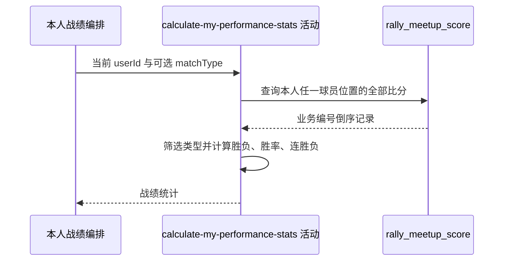

## 概要

查询并筛选本人盘级比分，计算胜负、胜率和当前连续战绩。

## 时序图

## 触发条件

已登录用户请求总体或指定比赛类型战绩后执行；不读取用户账户或网球档案。

## 活动契约

入参为当前 `userId` 和可选 `SINGLE/DOUBLE/RALLY`；返回 total、wins、losses、无百分号一位小数 winRate，以及可空 streakType/streakCount。

## 异常分支

| 错误标识 | 触发条件 | 处理 |
|---|---|---|
| `SYSTEM_ERROR` | 比分查询或持久化枚举转换失败 | 终止只读活动 |
| 无 | 没有比分或类型筛选无结果 | 返回零统计、`--` 和空连续战绩 |

## 领域依赖

无

## 业务动作

A1 查询本人出现在任一球员位置的全部盘记录
A2 按可选比赛类型过滤
A3 按持久化胜方计算本人胜负和胜率
A4 从最新盘起计算连续相同结果

## 详细流程

1. `A1` SQL 以四个球员位置任一等于本人为条件，按雪花 `biz_id DESC` 返回全部历史记录；不限制约球状态、时间或复盘状态。
2. `A2` 未传类型保留全部，传入时与记录 `matchType` 完全相等。
3. `A3` 本人在 A1/A2 任一位置即视为 A 侧；若同时出现在两侧也优先 A。A 侧且 `winSide=A`，或非 A 侧且 `winSide=B` 才算胜，其余都算负。
4. 不按比分重算胜方；total 按盘计，losses=total-wins，胜率为 `wins*100/total` 格式化一位小数且无 `%`，零盘为 `--`。
5. `A4` 从过滤后首条开始，以其胜负为 streakType，连续累计直到第一条不同结果；零盘时类型和次数均为 null。
6. 活动只读，不缓存、不回写档案或评分。

## 边界情况

- 没有账户或档案不影响统计，只依赖登录 userId 字符串。
- 本人同时出现在 A/B 两侧时按 A 侧判断。
- 异常 winSide 值会被算法归为负。
- 雪花编号排序而非 meetupDate 决定“最新”和连续战绩。

## 实现提示

只读字段已按当前 DB snapshot 声明；若需要按场而非按盘统计，必须先定义多盘聚合胜负规则。
