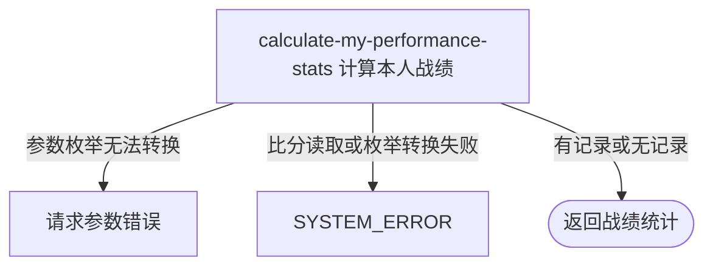

## 概要

按盘汇总本人当前胜负、胜率和连续战绩。

## 触发

登录用户查看本人总体战绩或某一比赛类型战绩时发起。一次查询实时读取本人全部盘级比分并在内存中汇总；不需要用户账户或网球档案存在，也不产生缓存或业务写入。

## 接口契约

### 查询参数

| 字段 | 类型 | 必填 | 约束 |
|---|---|---|---|
| `matchType` | 枚举 | 否 | `SINGLE`、`DOUBLE` 或 `RALLY`；省略时统计全部类型 |

### 成功响应

| 字段 | 类型 | 说明 |
|---|---|---|
| `total` | 长整数 | 过滤后盘级比分总数 |
| `wins` | 长整数 | 本人所在侧与 `winSide` 一致的盘数 |
| `losses` | 长整数 | `total - wins` |
| `winRate` | 字符串 | 胜率百分数值，固定一位小数且不带 `%`；无记录为 `--` |
| `streakType` | 字符串或空 | 最新连续结果，`WIN` 或 `LOSE`；无记录为 `null` |
| `streakCount` | 长整数或空 | 从最新记录起连续相同结果的盘数；无记录为 `null` |

## 业务活动

- calculate-my-performance-stats  查询并筛选本人盘级比分，计算胜负、胜率和当前连续战绩

## 流程图

## 详细流程

1. 识别当前登录用户，不读取或校验用户账户和个人档案。
2. 查询本人出现在四个球员位置任一处的全部比分，按比分业务编号倒序排列；不校验约球状态、复盘状态或时间范围。
3. 未指定比赛类型时保留全部记录；指定 `SINGLE`、`DOUBLE` 或 `RALLY` 时只保留完全匹配的记录。
4. 对每盘判断本人是否在 A 侧；若同时出现在两侧，优先视为 A 侧。本人所在侧与持久化 `winSide` 一致才计胜，否则一律计负，不根据比分重新计算胜方。
5. 总数按盘级记录计数，负数用总数减胜数；胜率以胜数除以总数后格式化为一位小数且不带百分号，无记录时为 `--`。
6. 从业务编号最大的最新记录开始，以其胜负类型为连续战绩类型，累计直到首条不同结果；没有记录时类型和次数均为 `null`。
7. 返回统计结果，不写回档案、评分或任何比分记录。

## 异常分支

| 对外失败码 | 触发条件 | 由哪个活动报出 | 补偿动作或超时处理 | 对外提示 |
|---|---|---|---|---|
| 请求参数错误 | `matchType` 不是支持的枚举值 | 流程 | 只读，无需补偿 | 参数类型错误 |
| `SYSTEM_ERROR` | 持久化比赛类型无法转换、比分查询失败或发生未归类异常 | calculate-my-performance-stats | 只读，无需补偿 | 系统异常，请稍后重试 |

没有账户、没有网球档案、没有比分或筛选后无比分都不是异常。异常 `winSide`、本人同时出现在两侧等数据问题也不会拒绝查询，而会按当前判定算法计为胜或负。

## 技术线索

- HTTP 接口：`GET /recap/score/stats/me`
- 数据表：`rally_meetup_score`
- 本人匹配：`side_a_player1`、`side_a_player2`、`side_b_player1`、`side_b_player2` 任一相等
- 排序：`biz_id DESC`
- 类型筛选：可选 `MatchTypeEnum`
- 胜负算法：A 侧优先；仅 A+`A` 或非 A+`B` 为胜
- 胜率格式：`String.format("%.1f", wins * 100.0 / total)`
- 连续战绩：从过滤后首条开始，在首个不同胜负结果处停止
