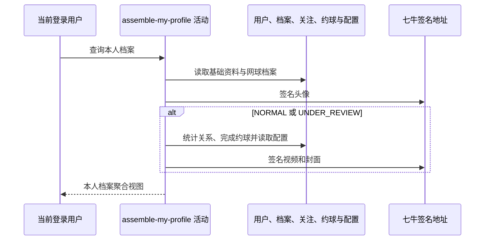

## 概要

读取本人基础资料、网球档案及关联统计，按档案状态组装个人档案聚合视图。

## 时序图

## 触发条件

登录用户调用 `GET /user/profile/me` 查看本人档案时执行。

## 活动契约

无业务入参，从登录上下文取得 `userId`；返回档案状态和基础用户资料，并仅在档案为 `NORMAL` 或 `UNDER_REVIEW` 时返回统计、等级、评分和视频分组。活动全程只读。

## 异常分支

| 错误标识 | 触发条件 | 处理 |
|---|---|---|
| `TOKEN_INVALID` | 当前登录身份没有对应基础用户 | 终止查询，不创建档案 |
| `SYSTEM_ERROR` | 城市、档案、统计、配置、资源签名或封面处理失败 | 终止整份聚合查询 |

## 领域依赖

无

## 业务动作

A1 读取基础资料和网球档案并判定状态
A2 组装用户资料及头像签名地址
A3 对完整档案统计关系和完成约球
A4 计算等级提示与评分明细
A5 组装视频签名地址、封面与上传限制

## 详细流程

1. `A1` 从登录上下文取得用户编号并读取用户；用户不存在时报 `TOKEN_INVALID`。没有网球档案时状态为 `NONE`，`TBC` 视为不完整，`NORMAL/UNDER_REVIEW` 视为完整。
2. `A2` 始终返回用户编号、昵称、性别、生日、城市、简介，并把头像键生成 3600 秒签名地址；非空城市编码通过城市缓存取得名称。
3. `NONE/TBC` 时 `stats/level/score/video` 均为 null，直接返回，不读取完整档案所需统计和配置。
4. `A3` 分别统计 follower、following，并按本人报名状态为 `REVIEWED/SKIPPED` 且约球状态非 `DRAFT` 的口径统计完成约球。
5. `A4` 把 NTRP 保留一位小数；按冷却期与核查剩余场次决定提示及可修改性，并读取评分阈值、上限和说明配置计算综合等级。一般状态下的系统建议为固定文案，不读取近期战绩。
6. `A5` 遍历档案视频，为每项生成一小时签名地址，把最后扩展名替换成 `.jpg` 作封面，空白标题显示“未命名”；同时读取数量、大小、时长上限配置。
7. 返回聚合结果，不持久化计算值。七牛 RPC snapshot 当前缺失，资源签名行为按现有 Java 调用确认。

## 边界情况

- 空城市、空头像、空视频 key 和空白视频标题不是异常；空白标题统一展示“未命名”。
- 完整档案的 NTRP 为 null 时，一位小数转换可能失败。
- videos 为 null 或非空资源键没有可替换扩展名时，视频组装可能失败。
- 档案顶层状态与 `is_under_review` 分别决定完整分组和提示，两者不一致时不会互相修正。
- 配置非法整数或小数按配置工具规则降级为 0，可能产生失真的评级、期限或限制。

## 实现提示

只读表列已按当前 DB snapshot 声明；关注和完成约球为实时计数。外部资源签名失败会使整份查询失败，不缓存半成品结果。
