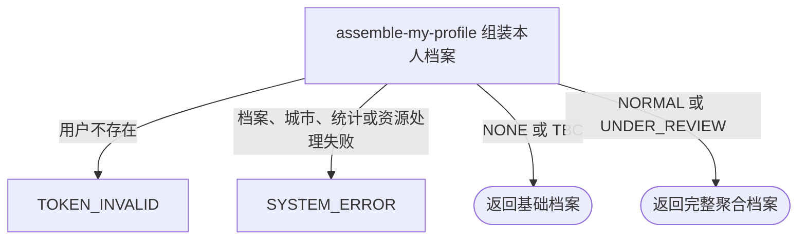

## 概要

聚合返回当前用户的基础资料、等级、评分、视频和活动统计。

## 触发

登录用户查看本人当前个人档案时发起。接口实时聚合基础资料、关系与约球统计、等级、评分和视频；不接受目标用户编号，不创建缺失档案，也不写入任何查询结果。

## 接口契约

无业务查询参数。

### 成功响应

| 结果分组 | 返回条件 | 主要内容 |
|---|---|---|
| `status` | 始终 | `NONE`、`TBC`、`NORMAL` 或 `UNDER_REVIEW` |
| `user` | 始终 | 用户编号、昵称、头像签名地址、性别、生日、城市编码与名称、简介 |
| `stats` | `NORMAL`、`UNDER_REVIEW` | 粉丝数、关注数、完成态报名对应的约球数 |
| `level` | `NORMAL`、`UNDER_REVIEW` | NTRP、当前提示、固定说明与是否可修改 |
| `score` | `NORMAL`、`UNDER_REVIEW` | 综合评级及信誉分、可信度、校准度明细 |
| `video` | `NORMAL`、`UNDER_REVIEW` | 全部视频及封面签名地址、标题、数量和上传限制 |

头像、视频与封面签名地址有效期固定为 3600 秒。`NONE`、`TBC` 时后四个网球档案分组为 `null`。

## 业务活动

- assemble-my-profile  读取本人资料及关联统计，按档案状态组装个人档案聚合视图

## 流程图

## 详细流程

1. 识别当前登录用户，读取基础资料与网球档案；基础用户不存在时按无效登录身份拒绝，不自动创建任何记录。
2. 确定档案状态并组装基础资料：头像资源标识生成一小时签名地址，非空城市编码从城市缓存补充名称。
3. 没有网球档案时返回 `NONE`，状态为 `TBC` 时返回待完善；两者只交付状态和基础资料，不查询统计、等级、评分或视频。
4. `NORMAL` 或 `UNDER_REVIEW` 时，分别统计粉丝数、关注数，以及本人报名状态为 `REVIEWED` 或 `SKIPPED` 的约球数；不以约球状态、时间或比分判断完成。
5. 返回 NTRP 和修改提示：冷却天数按可信度固定分档选择配置；核查提示是否出现依据 `isUnderReview` 与剩余场次，而档案顶层状态依据 `status`，两者不一致时不会互相修正。
6. 按三项评分与当前阈值配置计算综合评级，并返回三项分值、上限和说明。一般状态下的“系统建议”和“90天冻结期”说明为固定文案，未读取近 20 场战绩。
7. 遍历完整视频列表，为视频和替换最后扩展名所得 `.jpg` 封面生成一小时签名地址，空白标题显示“未命名”，并返回当前数量、大小与时长限制配置。
8. 返回聚合结果，全程只读；任一必要数据、城市、配置、统计或资源地址处理失败都会终止整份查询。

## 异常分支

| 对外失败码 | 触发条件 | 由哪个活动报出 | 补偿动作或超时处理 | 对外提示 |
|---|---|---|---|---|
| `TOKEN_INVALID` | 登录身份没有对应基础用户记录 | assemble-my-profile | 只读，无需补偿；不初始化档案 | 登录凭证无效，请重新登录 |
| `SYSTEM_ERROR` | 持久化档案状态或视频 JSON 无法转换 | assemble-my-profile | 只读，无需补偿 | 系统异常，请稍后重试 |
| `SYSTEM_ERROR` | 非空城市编码不在城市缓存 | assemble-my-profile | 只读，无需补偿 | 系统异常，请稍后重试 |
| `SYSTEM_ERROR` | `NORMAL`、`UNDER_REVIEW` 档案缺少 NTRP、评分或视频列表等必要数据 | assemble-my-profile | 只读，无需补偿 | 系统异常，请稍后重试 |
| `SYSTEM_ERROR` | 非空视频 key 无扩展名、七牛签名配置或构址失败 | assemble-my-profile | 只读，无需补偿 | 系统异常，请稍后重试 |
| `SYSTEM_ERROR` | 用户、关注、约球、配置读取或其他聚合依赖失败 | assemble-my-profile | 只读，无需补偿 | 系统异常，请稍后重试 |

没有网球档案、`TBC`、空城市、空头像、空视频 key 和空白视频标题都不是异常。数字配置无法解析时按 `0` 降级并继续返回，结果中的评级、期限或限制可能因此失真。

## 技术线索

- HTTP 接口：`GET /user/profile/me`
- 聚合入口：`MyProfileAppService.getMyProfile`
- 用户定位：`UserContext`；`UserProfileDomainService.get`
- 完整分组门槛：`UserProfile.hasProfile`，即状态不是 `NONE`、`TBC`
- 完成数量：报名状态 `REVIEWED`、`SKIPPED`，不检查约球时间与状态
- 冷却分档：可信度 `<30`、`<60`、其余，分别读取低中高天数配置
- 提示优先级：冷却期 → 核查期 → 固定“系统建议”
- 综合评级：`ProfileLevelManager.calculate` 读取 S/A/B 阈值配置
- 资源地址：七牛签名 URL 固定 3600 秒；视频封面把最后扩展名替换为 `.jpg`
- 视频限制：读取数量、大小、时长配置，仅用于展示
