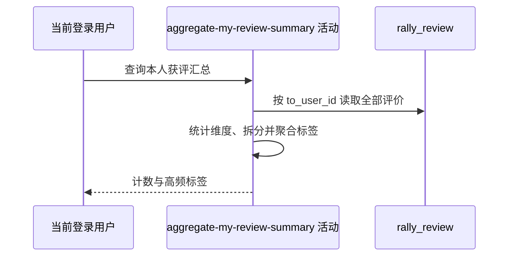

## 概要

读取本人全部获评记录，汇总评价维度计数和最多五个高频标签。

## 时序图

## 触发条件

登录用户调用 `GET /recap/review/me` 查看累计获评概览时执行。

## 活动契约

无业务入参，从登录上下文取得本人 `userId`；返回 `total`、水平票数、出勤票数、标签出现总数和最多五个高频标签。全程只读。

## 异常分支

| 错误标识 | 触发条件 | 处理 |
|---|---|---|
| `SYSTEM_ERROR` | 持久化评价类型不能转换为支持的枚举 | 终止查询 |
| `SYSTEM_ERROR` | TAG 记录的评价值为 null，或评价读取失败 | 终止查询 |

## 领域依赖

无

## 业务动作

A1 读取本人全部获评记录
A2 统计水平票与出勤票记录数
A3 拆分标签并计算标签总数
A4 聚合并截取高频标签

## 详细流程

1. `A1` 从登录上下文取得用户编号，按 `to_user_id` 一次读取全部历史评价；不校验账户或档案，不限制时间、约球状态，也不去重。
2. `A2` 按记录条数分别统计 `LEVEL_VOTE` 和 `ATTENDANCE_VOTE`，不区分投票值。
3. `A3` 对每条 `TAG` 的 `review_value` 按英文逗号拆分。`tagCount` 统计拆分后原字符串非空的数量，不先去空白，因此纯空格标签也计数；同一记录中的重复标签重复计数。
4. `A4` 高频标签先去首尾空白并排除空标签，再按名称累计次数、次数降序取前五；同次数无稳定次级排序。
5. `total = levelVoteCount + attendanceVoteCount + tagCount`。无评价时各计数为 0、标签数组为空。
6. 返回汇总，不更新评价、报名、档案、NTRP 或评分。

## 边界情况

- 账户或个人档案不存在不影响按登录用户编号汇总。
- 空字符串 TAG 不计数也不展示；纯空格 TAG 增加 `tagCount`，但不会进入高频标签。
- 标签未规范大小写，相同文字的不同大小写分别累计。
- 次数相同的标签缺少稳定排序，返回顺序可能变化。

## 实现提示

只读 `rally_review` 的精确列已按当前 DB snapshot 声明；聚合在内存中完成，数据量随本人历史获评总数增长。
