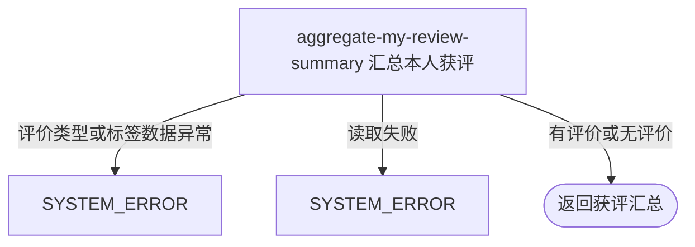

## 概要

汇总本人收到的评价维度数量与最多五个高频标签。

## 触发

登录用户查看本人累计获评概览时发起。接口读取所有以本人为被评价人的历史记录并实时聚合；不接受目标用户、时间或约球筛选，也不产生业务写入。

## 接口契约

无业务查询参数。

### 成功响应

| 字段 | 类型 | 说明 |
|---|---|---|
| `total` | 长整数 | 水平票记录数、出勤票记录数与标签出现次数之和 |
| `levelVoteCount` | 长整数 | `LEVEL_VOTE` 评价记录数 |
| `attendanceVoteCount` | 长整数 | `ATTENDANCE_VOTE` 评价记录数 |
| `tagCount` | 长整数 | 所有 `TAG` 内容按英文逗号拆分后的非空原字符串数量 |
| `tags` | 数组 | 去空白后的高频标签，按次数降序，最多五项 |
| `tags[].name` | 字符串 | 标签名称 |
| `tags[].count` | 长整数 | 标签累计出现次数 |

无评价时四项计数均为 `0`，`tags` 为空数组。

## 业务活动

- aggregate-my-review-summary  读取本人全部获评，汇总评价维度计数与高频标签

## 流程图

## 详细流程

1. 识别当前登录用户，不读取或校验账户、个人档案、约球和参与关系。
2. 一次读取所有 `toUserId` 为本人的历史评价，不限制时间、约球状态或复盘状态。
3. 分别按记录条数统计 `LEVEL_VOTE` 与 `ATTENDANCE_VOTE`，不区分具体投票值，也不按评价人或约球去重。
4. 对每条 `TAG` 评价按英文逗号拆分。标签总数只排除拆分后长度为零的字符串，不先去空白，因此纯空格标签会计入总数；高频标签则先去首尾空白并排除空标签。
5. 相同标签累计出现次数，同一条评价内重复标签也重复计数；按次数降序取最多五项，同次数没有稳定次级排序。
6. 用水平票记录数、出勤票记录数和标签出现次数相加得到 `total`，返回各项计数与高频标签。没有评价时全部计数为零、标签列表为空。
7. 全程只读，不改变评价、报名、档案、NTRP 或评分。

## 异常分支

| 对外失败码 | 触发条件 | 由哪个活动报出 | 补偿动作或超时处理 | 对外提示 |
|---|---|---|---|---|
| `SYSTEM_ERROR` | 持久化 `review_type` 无法转换为支持的枚举 | aggregate-my-review-summary | 只读，无需补偿 | 系统异常，请稍后重试 |
| `SYSTEM_ERROR` | `TAG` 记录的 `review_value` 为 `null` | aggregate-my-review-summary | 只读，无需补偿 | 系统异常，请稍后重试 |
| `SYSTEM_ERROR` | 评价读取失败或发生其他未归类异常 | aggregate-my-review-summary | 只读，无需补偿 | 系统异常，请稍后重试 |

账户或档案不存在、无评价、标签值为空字符串、纯空格标签和重复标签都不是异常。纯空格标签会增加 `tagCount`，但在高频标签去空白后不会展示。

## 技术线索

- HTTP 接口：`GET /recap/review/me`
- 数据表：`rally_review`
- 查询条件：`to_user_id = 当前用户`
- 评价维度：`LEVEL_VOTE`、`ATTENDANCE_VOTE`、`TAG`
- 标签分隔：英文逗号 `,`
- 标签总数：拆分后先判断原字符串非空，不执行 `trim`
- 高频标签：`trim`、排空、`groupingBy` 计数、次数降序、固定 `limit(5)`
- 同次数顺序：没有显式次级排序，依赖散列表遍历顺序
