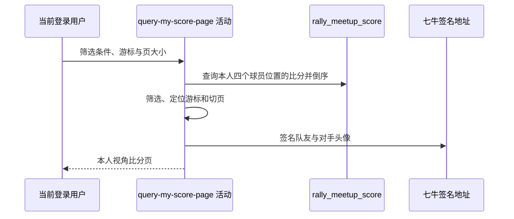

## 概要

查询本人参与的盘级比分，按条件筛选、游标分页并转换为本人视角的比分明细。

## 时序图

## 触发条件

登录用户调用 `POST /recap/score/list/me` 查看或继续翻阅本人比分列表时执行；请求体必须存在。

## 活动契约

入参为可选 `matchType`、`meetupId`、`lastId` 和 `pageSize`；返回盘级比分列表、`hasMore` 与可选 `nextCursor`，`total` 固定为 null。活动全程只读。

## 异常分支

| 错误标识 | 触发条件 | 处理 |
|---|---|---|
| 请求解析失败 | 请求体缺失或比赛类型不受支持 | 由接口层拒绝 |
| `SYSTEM_ERROR` | 游标首项不是字符串或页大小形成非法范围 | 终止查询 |
| `SYSTEM_ERROR` | 比分枚举、日期、头像签名或持久化读取失败 | 终止整页转换 |

## 领域依赖

无

## 业务动作

A1 查询并筛选本人盘级比分
A2 解析游标并截取分页窗口
A3 判定本人侧与胜负
A4 转换双方比分和球员快照
A5 生成分页游标

## 详细流程

1. `A1` 从登录上下文取得用户编号，查询其出现在四个球员位置任一处的全部比分并按 `biz_id` 倒序；不读取账户、档案或约球。
2. `matchType` 为空时保留包括 `RALLY` 在内的全部类型，指定时仅支持 `SINGLE/DOUBLE`；`meetupId` 为非 null 时完全相等筛选，空串也作为实际条件。
3. `A2` 将 `lastId` 按 URL-safe Base64 JSON 数组解码并取首项字符串；空白、非法、空数组或游标不在筛选集时从首页开始。页大小默认为 20，当前不校验正数或上限。
4. 从游标后取 `pageSize + 1` 条探测下一页，有更多时截取前 `pageSize` 条。
5. `A3` 本人出现在 A 侧任一位置即视为 A 侧，同时出现在两侧也优先 A；持久化 `win_side` 与本人侧一致才判胜，否则判负，不按比分重算。
6. `A4` 输出本人侧与对侧主分、抢七分和性别；双打返回同侧另一人作队友，对侧一至两人作对手，均使用保存比分时的昵称、头像、性别快照。头像生成 3600 秒签名地址，日期格式为 `MM-dd`。
7. `A5` 返回列表和 `hasMore`；仅有更多且本页非空时，以末条 `bizId` 编码下一页游标，`total` 始终为 null。

## 边界情况

- 无比分、筛选后为空、非法或未命中的游标均返回可用页面而非报错；非法游标按首页。
- `pageSize=0` 且存在数据时会得到空列表、`hasMore=true`、`nextCursor=null`；负数或加一溢出可能失败。
- 同一约球的每盘是独立记录，但响应不交付 `set_number`。
- 空队友或第二对手字段保留 null；非空头像签名失败会使整页失败。

## 实现提示

只读列已按当前 DB snapshot 精确声明；筛选和分页均在读取本人全部比分后于内存执行。七牛 RPC snapshot 当前缺失，签名行为按现有 Java 调用确认。
