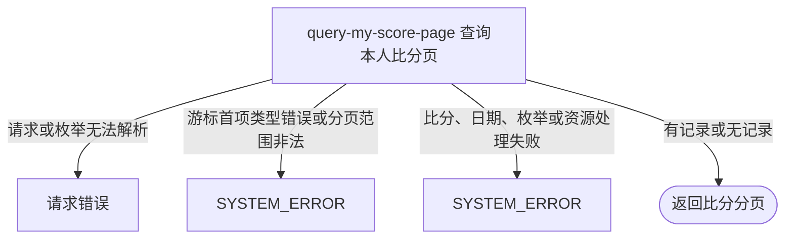

## 概要

筛选并游标分页返回本人参与的盘级比分明细。

## 触发

登录用户查看本人比分列表，或按比赛类型、约球继续翻页时发起。请求体必须存在，但各筛选字段均可省略；接口在内存中筛选和分页，不写入任何业务对象。

## 接口契约

### 请求参数

| 字段 | 类型 | 必填 | 约束与语义 |
|---|---|---|---|
| `matchType` | 枚举 | 否 | 仅 `SINGLE`、`DOUBLE`；省略时包含包括 `RALLY` 在内的全部类型 |
| `meetupId` | 字符串 | 否 | `null` 不筛选；包括空串在内的非 `null` 值按完全相等筛选 |
| `lastId` | 字符串 | 否 | URL-safe Base64 JSON 数组游标，首项为上一页末条 `bizId`；不是裸业务编号 |
| `pageSize` | 整数 | 否 | 默认 20；当前没有正数与上限校验 |

### 成功响应

| 字段 | 类型 | 说明 |
|---|---|---|
| `list` | 数组 | 本页比分，源记录按 `bizId` 倒序 |
| `list[].bizId`、`meetupId` | 字符串 | 比分业务编号与所属约球 |
| `list[].resultType`、`resultTypeShow` | 枚举、字符串 | 本人视角的 `WIN`/`LOSE` 与展示名 |
| `list[].matchType`、`setFormat` | 枚举 | 比赛类型与盘制，另含对应展示名 |
| `list[].date` | 字符串 | `meetupDate` 格式化为 `MM-dd` |
| `list[].myScore`、`opponentScore` | 字符串 | 本人侧与对侧主分 |
| `list[].myTiebreakScore`、`opponentTiebreakScore` | 字符串或空 | 本人侧与对侧抢七分 |
| `list[].myGender` | 枚举或空 | 本人在保存比分时的性别快照 |
| `list[].teammate*`、`opponent1*`、`opponent2*` | 多字段 | 队友和对手的编号、昵称、头像签名地址、性别快照 |
| `total` | 空 | 当前固定为 `null`，不计算符合条件总数 |
| `hasMore` | 布尔 | 是否仍有下一页 |
| `nextCursor` | 字符串或空 | 有更多且本页非空时，以末条 `bizId` 编码的下一页游标 |

结果不交付 `setNum`，同一约球的多盘需由比分业务编号及其他展示字段区分。

## 业务活动

- query-my-score-page  查询、筛选、游标分页并转换本人视角的比分明细

## 流程图

## 详细流程

1. 识别当前登录用户，查询本人出现在四个球员位置任一处的全部比分，按业务编号倒序；不读取账户、档案或约球，也不检查时间与复盘状态。
2. `matchType` 为空时保留 `SINGLE`、`DOUBLE`、`RALLY` 等全部记录；指定时命令只支持 `SINGLE` 或 `DOUBLE`。`meetupId` 非 `null` 时再按完全相等筛选，空字符串也作为实际筛选值。
3. 将 `lastId` 按 URL-safe Base64 JSON 数组解码并取首项字符串。空白、非法或空数组按首页；首项类型不是字符串时失败；合法但不在当前筛选集时也从首页开始。
4. `pageSize` 为空使用 20，未限制最小值和最大值。按游标后取 `pageSize + 1` 条判断是否有下一页，再截取本页。
5. 对每条比分先判断本人是否在 A 侧；同时出现在两侧时按 A 侧。持久化胜方与本人侧一致为胜，否则为负，不根据分数重算。
6. 转换为本人视角的主分、抢七分、性别、同侧队友与对侧一至两名对手，展示保存时的昵称、头像和性别快照；头像资源标识转换为一小时签名地址，比赛日期固定格式化为 `MM-dd`。
7. 返回本页列表、`hasMore` 和可选下一页游标，`total` 始终为 `null`。只有仍有下一页且本页非空时才生成游标。

## 异常分支

| 对外失败码 | 触发条件 | 由哪个活动报出 | 补偿动作或超时处理 | 对外提示 |
|---|---|---|---|---|
| 请求解析失败 | 请求体缺失、无法解析，或 `matchType` 不是 `SINGLE`、`DOUBLE` | 流程 | 只读，无需补偿 | 按框架请求错误或系统异常返回 |
| `SYSTEM_ERROR` | 游标可解码但首项不是字符串 | query-my-score-page | 只读，无需补偿 | 系统异常，请稍后重试 |
| `SYSTEM_ERROR` | `pageSize` 为负数、加一溢出或形成非法分页范围 | query-my-score-page | 只读，无需补偿 | 系统异常，请稍后重试 |
| `SYSTEM_ERROR` | 比分持久化枚举无法转换，或 `meetupDate` 为空 | query-my-score-page | 只读，无需补偿 | 系统异常，请稍后重试 |
| `SYSTEM_ERROR` | 非空头像资源无法签名、比分读取或其他转换失败 | query-my-score-page | 只读，无需补偿 | 系统异常，请稍后重试 |

没有账户或档案、无比分、筛选后无结果、空白或非法游标、游标不在当前筛选集都不是异常。后三类游标按首页处理。`pageSize=0` 且有记录时返回空列表、`hasMore=true`、`nextCursor=null`。

## 技术线索

- HTTP 接口：`POST /recap/score/list/me`
- 数据表：`rally_meetup_score`
- 本人匹配：四个球员列任一相等；排序 `biz_id DESC`
- 内存筛选：可选比赛类型和 `rally_meetup_id`
- 游标格式：URL-safe Base64 无填充编码的 JSON 数组 `[bizId]`
- 游标定位：在筛选后列表查找相同 `bizId`，找不到时从索引 0 开始
- 分页探测：取 `pageSize + 1`，默认页大小 20
- 视角算法：A 侧优先；仅 A+`A` 或非 A+`B` 为胜
- 日期格式：`MM-dd`
- 头像地址：基于比分保存时快照生成 3600 秒七牛签名 URL
