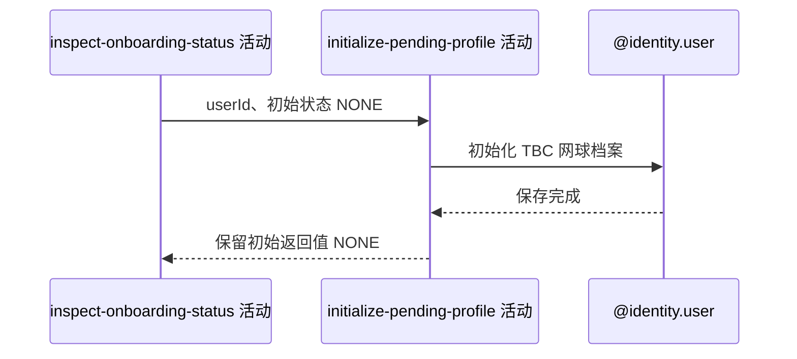

## 概要

在检查结果为 `NONE` 时创建并持久化一份归属本人的 `TBC` 网球档案。

## 时序图

## 触发条件

上游检查确认查询开始时没有网球档案，即状态为 `NONE` 时执行。

## 活动契约

入参为当前 `userId` 与已确认的 `NONE` 状态；创建视频列表为空、状态为 `TBC` 的网球档案并持久化。成功后不返回新状态，流程仍交付上游的 `NONE`。

## 异常分支

| 错误标识 | 触发条件 | 处理 |
|---|---|---|
| `SYSTEM_ERROR` | 档案插入失败或并发首次查询触发用户唯一键冲突 | 本请求失败；其他并发请求已成功的档案不回滚 |

## 领域依赖

### @identity.user

- 输入：当前用户编号与初始化待完善网球档案的意图
- 输出：创建并持久化一份 `TBC` 档案，或返回保存失败

## 业务动作

A1 构造待完善网球档案
A2 持久化初始化结果
A3 保留查询开始时的返回状态

## 详细流程

1. `A1` 仅在上游状态为 `NONE` 时，基于现有用户构造网球档案：`userId` 为当前用户、`status=TBC`、`videos=[]`。
2. `A2` 保存新档案；仓储生成雪花 `biz_id`，数据库默认三项评分为 0、`is_under_review=0`、`is_newbie=1` 并填写时间。
3. `A3` 保存成功后不重新查询，流程仍返回初始化前的 `NONE`；下一次请求才观察到 `TBC`。
4. 入口没有事务注解；插入自身单独提交，后续也没有需要一并回滚的动作。

## 边界情况

- 两个首次请求可同时读到 `NONE`；用户唯一键只允许一条成功，冲突请求不会改为读取已存在档案。
- 不接受请求提供的用户编号、状态、评分或视频，避免越权和初始化污染。
- 首次响应为 `NONE` 不表示请求完成后数据库仍无档案。

## 实现提示

这是有副作用的 GET 活动，调用方不可假定幂等成功；写入通过 `@identity.user` 领域依赖表达，因此 `reads` 保持为空且不声明写表。
