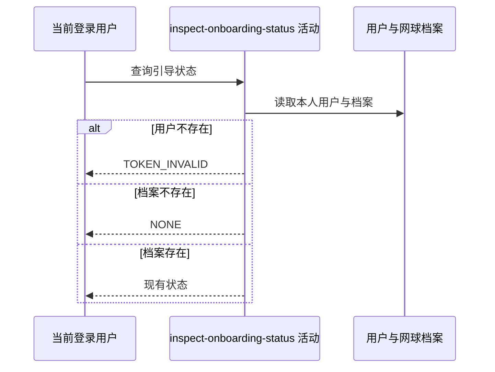

## 概要

读取本人基础用户与网球档案，识别本次查询开始时的引导状态。

## 时序图

## 触发条件

登录用户调用 `GET /user/onboarding/status` 时首先执行。

## 活动契约

无业务入参，从登录上下文取得 `userId`；输出读取当时的 `NONE/TBC/NORMAL/UNDER_REVIEW` 状态。本活动只读，不自行初始化档案。

## 异常分支

| 错误标识 | 触发条件 | 处理 |
|---|---|---|
| `TOKEN_INVALID` | 当前用户记录不存在 | 终止流程，不创建用户或档案 |
| `SYSTEM_ERROR` | 档案状态、视频数据转换或持久化读取失败 | 终止流程 |

## 领域依赖

无

## 业务动作

A1 定位当前基础用户
A2 读取网球档案并判定初始状态

## 详细流程

1. `A1` 以登录上下文用户编号读取基础用户；不存在时报 `TOKEN_INVALID`。
2. `A2` 同时读取该用户的网球档案；不存在映射为 `NONE`，存在则采用持久化的 `TBC/NORMAL/UNDER_REVIEW`。
3. 把查询开始时的状态交给后续编排；只有 `NONE` 才触发初始化活动。

## 边界情况

- 无网球档案是正常状态，不在本活动内建档。
- 已有任一可识别状态时不修改档案字段。
- 本活动结果刻画读取时点，后续初始化不会回写此结果。

## 实现提示

只读表列已按当前 DB snapshot 声明；现有仓储会构造完整用户档案数据，因此声明包含转换所需档案列。
