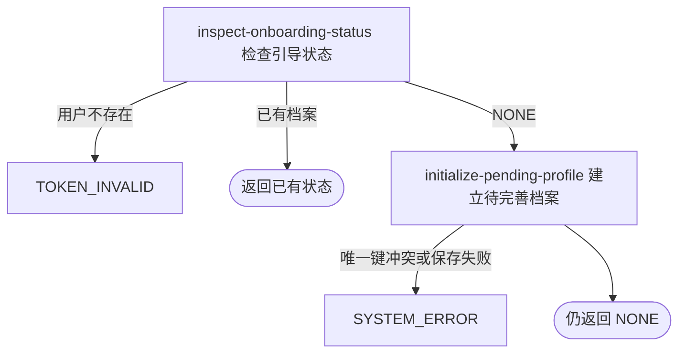

## 概要

返回本人查询开始时的档案状态，并在无档案时建立待完善档案。

## 触发

登录用户进入档案引导前查询本人当前状态时发起。该 GET 入口在尚无网球档案时具有建档副作用；调用方收到的是查询开始时的状态，而不是建档后的终态。

## 接口契约

无业务查询参数。

### 成功响应

直接返回档案状态枚举：

| 返回值 | 查询开始时状态 | 请求结束后状态 |
|---|---|---|
| `NONE` | 无网球档案 | 已建立 `TBC` 档案 |
| `TBC` | 已有待完善档案 | 保持 `TBC` |
| `NORMAL` | 已有正常档案 | 保持 `NORMAL` |
| `UNDER_REVIEW` | 已有核查期档案 | 保持 `UNDER_REVIEW` |

接口不交付档案编号、基础资料、NTRP、评分、核查详情或视频。

## 业务活动

- inspect-onboarding-status  读取本人基础用户和网球档案，识别查询开始时的引导状态
- initialize-pending-profile  在状态为 `NONE` 时创建并持久化一份 `TBC` 网球档案

## 流程图

## 详细流程

1. 识别当前登录用户，读取基础用户与网球档案；基础用户不存在时按无效登录身份拒绝。
2. 已有档案时直接返回其 `TBC`、`NORMAL` 或 `UNDER_REVIEW` 状态，不更新任何档案字段。
3. 没有网球档案时，将本次查询识别出的状态记为 `NONE`，在内存创建视频列表为空、状态为 `TBC` 且归属当前用户的档案并持久化；数据库补齐业务编号、三项评分零值、核查标记和新人标记等默认值。
4. 建立成功后仍返回写入前识别到的 `NONE`，不重新读取或返回终态 `TBC`；下次查询才会返回 `TBC`。
5. 查询入口没有事务注解。并发首次查询可能都读到无档案，数据库按用户唯一约束只允许一条创建成功，冲突请求按系统异常失败而不会重查已有结果。
6. 接口只返回状态枚举，不交付档案编号、NTRP、评分或视频。

## 异常分支

| 对外失败码 | 触发条件 | 由哪个活动报出 | 补偿动作或超时处理 | 对外提示 |
|---|---|---|---|---|
| `TOKEN_INVALID` | 登录身份没有对应基础用户记录 | inspect-onboarding-status | 不创建用户或档案 | 登录凭证无效，请重新登录 |
| `SYSTEM_ERROR` | 持久化档案状态或视频数据无法转换，用户或档案读取失败 | inspect-onboarding-status | 不修改已有资料 | 系统异常，请稍后重试 |
| `SYSTEM_ERROR` | TBC 档案插入失败，或并发首次查询触发 `user_id` 唯一键冲突 | initialize-pending-profile | 本请求不确认建档；并发先成功的档案保留 | 系统异常，请稍后重试 |

无档案以及已有任一可识别状态都不是异常。首次返回 `NONE` 不代表请求结束后仍无档案，而是表示本次读取时尚未存在。

## 技术线索

- HTTP 接口：`GET /user/onboarding/status`
- 应用入口：`OnboardingAppService.checkStatus`，没有 `@Transactional`
- 用户与档案读取：`UserProfileDomainService.get`
- 显式初始化：`userId`、`status=TBC`、`videos=[]`
- 仓储初始化：插入时生成雪花 `biz_id`
- 数据库默认：三项评分 `0`、`is_under_review=0`、`is_newbie=1`、创建更新时间
- 唯一约束：`user_tennis_profile.uk_user_id (user_id)`
- 返回语义：初始化后直接 `return NONE`，不重新查询
