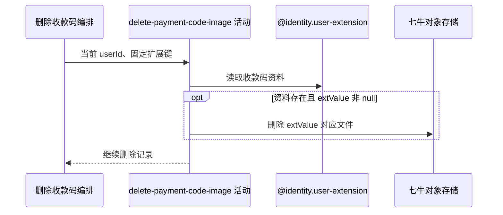

## 概要

读取本人固定收款码扩展资料，并物理删除其中非 null 的七牛资源 key。

## 时序图

## 触发条件

登录用户调用 `DELETE /user/payment-code` 后首先执行。

## 活动契约

入参为当前 `userId`，扩展键固定为 `wechat_payment_code`；读取扩展资料并在 `extValue` 非 null 时请求七牛物理删除。无资料或 null 值时跳过外部删除，不在本活动删除数据库记录。

## 异常分支

| 错误标识 | 触发条件 | 处理 |
|---|---|---|
| `SYSTEM_ERROR` | 七牛返回除文件不存在码 612 外的错误，或扩展资料读取失败 | 终止流程，数据库记录不删除；外部实际状态不补偿 |

## 领域依赖

### @identity.user-extension

- 输入：当前用户编号与固定扩展键
- 输出：对应扩展资料或不存在结论，供外部文件删除使用

## 业务动作

A1 读取固定收款码资料
A2 删除非空资源 key 对应文件

## 详细流程

1. `A1` 以当前用户和 `wechat_payment_code` 查扩展资料，不校验基础账户。
2. 资料不存在或 `extValue` 为 null 时跳过外部删除，仍进入下游数据库删除活动。
3. `A2` 对非 null 值直接调用七牛删除，不校验格式、文件类型、资源归属或是否确为收款码；空字符串也会被调用。
4. 七牛返回 612 视为文件已不存在并继续，其他错误终止流程。

## 边界情况

- 首次无资料不会在本活动报 `USER_EXT_NOT_FOUND`，错误由下游二次读取产生。
- 七牛删除不参加数据库事务，调用成功后无法通过事务回滚恢复文件。
- 并发保存可在本活动之后替换资料；本活动只删除首读 key。

## 实现提示

活动包含外部删除副作用，通过 `@identity.user-extension` 读取业务资料，因此 `reads` 为空。七牛 RPC snapshot 当前缺失，612 容错按现有 Java 客户端确认。
