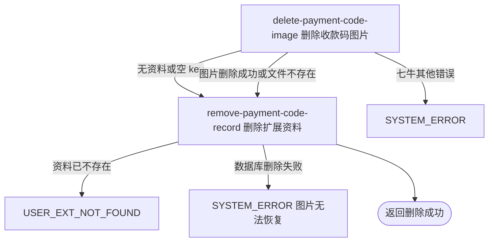

## 概要

先删除本人收款码图片，再移除对应扩展资料。

## 触发

登录用户请求移除本人当前收款码时发起。接口没有请求参数，固定操作扩展键 `wechat_payment_code`；要求资料在删除阶段存在，重复调用会失败。

## 接口契约

无业务请求参数。

### 成功响应

无业务数据；成功表示当前用户的固定收款码扩展资料已物理删除，且首轮读取到的非空图片 key 已请求从七牛删除或七牛明确返回文件不存在。接口不交付资料编号、资源 key、删除时间或外部结果。

## 业务活动

- delete-payment-code-image  读取收款码资料并物理删除其中非空的七牛资源 key
- remove-payment-code-record  再次确认资料存在，按当前用户与固定扩展键物理删除扩展记录

## 流程图

## 详细流程

1. 识别当前登录用户，以固定扩展键 `wechat_payment_code` 查询本人当前收款码资料；不读取或校验基础账户。
2. 资料存在且 `extValue` 非 `null` 时，把该值直接当七牛资源 key 请求物理删除；不校验格式、文件类型、资源归属或是否确为收款码。返回码 612 视为文件已经不存在并继续，其余外部错误终止流程。
3. 资料不存在时首查得到 `null`，跳过图片删除；随后删除活动再次查询并以 `USER_EXT_NOT_FOUND` 拒绝，因此重复删除不是成功。
4. 在数据库事务内再次读取固定扩展键资料，存在时按当前用户和扩展键物理删除。该二次读取未与第一步的业务编号或资源 key 做一致性比较。
5. 七牛删除不受数据库事务控制；图片删除后数据库删除失败只能回滚资料记录，无法恢复图片，可能留下引用失效资料。
6. 并发保存可能在两次读取之间替换资料，流程仍删除首读旧图片并移除二读时的新资料，新图片可能成为孤儿；并发删除也可能导致二读不存在而失败。
7. 返回成功但无业务数据，不交付删除的 key、资料编号或外部删除结果。

## 异常分支

| 对外失败码 | 触发条件 | 由哪个活动报出 | 补偿动作或超时处理 | 对外提示 |
|---|---|---|---|---|
| `USER_EXT_NOT_FOUND` | 首次即无资料，或图片处理后资料被并发删除 | remove-payment-code-record | 不删除数据库资料；首读图片可能已被删除且不恢复 | 用户扩展信息不存在 |
| `SYSTEM_ERROR` | 七牛删除返回除 612 以外的异常 | delete-payment-code-image | 数据库事务异常退出，收款码资料保留；外部文件状态以七牛实际结果为准 | 系统异常，请稍后重试 |
| `SYSTEM_ERROR` | 扩展资料二次读取或数据库删除、事务提交失败 | remove-payment-code-record | 数据库回滚资料删除，但已删除图片不恢复 | 系统异常，请稍后重试 |

七牛返回码 612 代表当前实现认定文件不存在，不作为失败。资料的 `extValue` 为 `null` 时跳过图片删除但仍删除资料；空字符串不是 `null`，会被作为资源 key 调用七牛。

## 技术线索

- HTTP 接口：`DELETE /user/payment-code`
- 事务入口：`PaymentCodeAppService.deletePaymentCode`
- 固定扩展键：`wechat_payment_code`
- 资料表：`user_ext`，按 `user_id + ext_key` 唯一
- 外部删除：`QiniuClient.deleteFile(extValue)`，612 被忽略
- 执行顺序：首读资料 → 外部删除 → 二读资料并断言存在 → 数据库物理删除
- 一致性限制：七牛不参加数据库事务，无补偿、版本、锁或二次读取一致性比较
