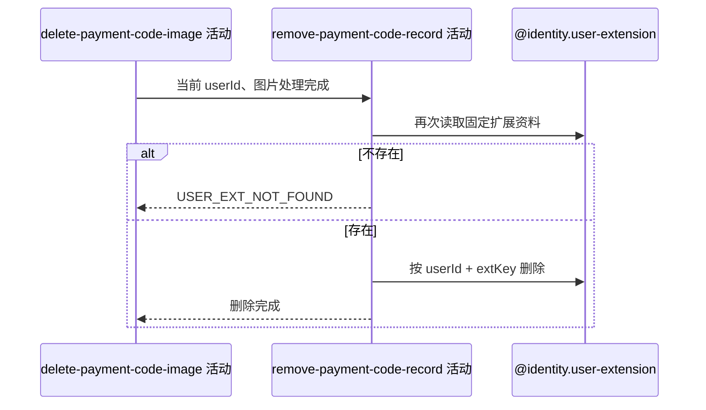

## 概要

再次确认本人收款码扩展资料存在，并按当前用户与固定扩展键物理删除记录。

## 时序图

## 触发条件

上游图片删除活动成功或跳过后执行。

## 活动契约

入参为当前 `userId`，扩展键固定为 `wechat_payment_code`；要求二次读取时资料存在，然后物理删除该记录。成功无业务返回。

## 异常分支

| 错误标识 | 触发条件 | 处理 |
|---|---|---|
| `USER_EXT_NOT_FOUND` | 二次读取时扩展资料不存在 | 终止流程；上游已删除的图片不恢复 |
| `SYSTEM_ERROR` | 二次读取、数据库删除或事务提交失败 | 回滚数据库删除；上游外部图片不恢复 |

## 领域依赖

### @identity.user-extension

- 输入：当前用户编号、固定扩展键与删除意图
- 输出：存在时删除扩展资料；不存在或失败时返回相应结论

## 业务动作

A1 二次读取并断言资料存在
A2 按用户和扩展键删除资料

## 详细流程

1. `A1` 在同一应用事务中，以当前用户和 `wechat_payment_code` 再次读取扩展资料；不存在时报 `USER_EXT_NOT_FOUND`。
2. 二次读取结果不与上游首读的业务编号或资源 key 比较。
3. `A2` 按 `user_id + ext_key` 物理删除资料并提交事务，成功后返回空结果。
4. 数据库失败只回滚记录删除，不能恢复上游已物理删除的七牛文件。

## 边界情况

- 重复删除在二次读取阶段失败，不提供幂等成功语义。
- 并发保存若在两次读取间替换记录，本活动会删除新资料，且新图片可能成为孤儿。
- 并发删除可使二次读取不存在；上游可能已经删除首读图片。

## 实现提示

写入通过 `@identity.user-extension` 领域依赖表达，`reads` 保持为空且不声明写表。外部文件和数据库没有原子提交或补偿机制。
