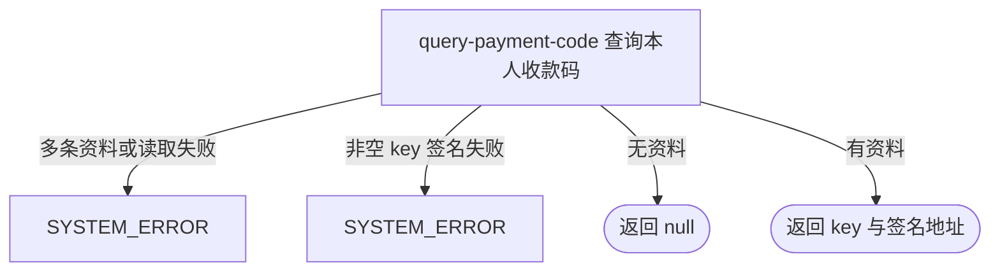

## 概要

返回本人当前收款码资源标识及一小时签名地址。

## 触发

登录用户查看本人当前保存的收款码时发起。接口没有查询参数，固定读取 `wechat_payment_code` 扩展资料；不存在时正常返回空数据，不创建资料。

## 接口契约

无业务查询参数。

### 成功响应

有资料时返回：

| 字段 | 类型 | 说明 |
|---|---|---|
| `key` | 字符串或空 | `user_ext.ext_value` 原值 |
| `paymentCodeUrl` | 字符串或空 | 将非空白 `key` 作为七牛资源标识生成的 3600 秒签名地址 |

没有资料时整个业务数据 `data` 为 `null`，不是空对象，也没有“未保存”状态字段。资料存在但 `key` 为空白时保留原 `key`，`paymentCodeUrl` 为 `null`。

## 业务活动

- query-payment-code  按本人和固定扩展键读取收款码，并生成可选签名访问地址

## 流程图

## 详细流程

1. 识别当前登录用户，不读取或校验基础账户和个人档案。
2. 以当前用户和固定扩展键 `wechat_payment_code` 查询唯一扩展资料；多条匹配记录会因唯一结果查询失败。
3. 没有资料时转换器直接返回 `null`，成功响应的数据体为空；不建立默认收款码，也不返回显式“未保存”状态。
4. 有资料时把 `extValue` 原样交付为 `key`，同时把它直接当七牛资源标识生成有效期 3600 秒的签名地址；`null`、空串或纯空白 key 的地址为 `null`。
5. 不核验保存值究竟是 key、URL 或 base64，不检查资源存在、所有权、图片格式或收款码内容。
6. 返回查询结果，全程只读，不刷新签名以外的数据，也不修改资料或外部资源。

## 异常分支

| 对外失败码 | 触发条件 | 由哪个活动报出 | 补偿动作或超时处理 | 对外提示 |
|---|---|---|---|---|
| `SYSTEM_ERROR` | 同一用户出现多条 `wechat_payment_code` 资料，唯一结果查询失败 | query-payment-code | 只读，无需补偿 | 系统异常，请稍后重试 |
| `SYSTEM_ERROR` | 非空资源 key 的七牛域名、凭据或签名构址失败 | query-payment-code | 只读，无需补偿；不降级为仅返回 key | 系统异常，请稍后重试 |
| `SYSTEM_ERROR` | 扩展资料读取或其他未归类异常 | query-payment-code | 只读，无需补偿 | 系统异常，请稍后重试 |

账户或个人档案不存在、无收款码资料、`extValue` 为 `null`、空串或纯空白都不是异常。

## 技术线索

- HTTP 接口：`GET /user/payment-code`
- 固定扩展键：`wechat_payment_code`
- 资料查询：`user_id + ext_key` 的 `.one()`
- DTO 转换：`PaymentCodeAppConvertMapper.toDTO`，输入 `null` 时输出 `null`
- 资源签名：`QiniuConfiguration.buildSignedUrl(extValue)`
- 空白判断：Apache `StringUtils.isBlank`
- 签名有效期：3600 秒
