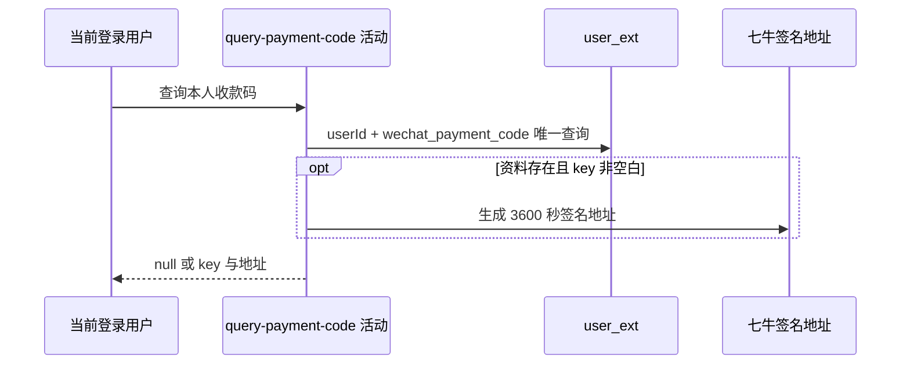

## 概要

按本人和固定扩展键读取收款码，返回资源原值及可选的一小时签名地址。

## 时序图

## 触发条件

登录用户调用 `GET /user/payment-code` 时执行。

## 活动契约

无业务入参，从登录上下文取得 `userId` 并固定查询 `wechat_payment_code`；无资料返回 null，有资料返回原始 `key` 和可选 `paymentCodeUrl`。全程只读。

## 异常分支

| 错误标识 | 触发条件 | 处理 |
|---|---|---|
| `SYSTEM_ERROR` | 唯一查询出现多条、资料读取失败，或非空白 key 签名失败 | 终止查询，不降级为仅返回 key |

## 领域依赖

无

## 业务动作

A1 查询本人固定收款码资料
A2 转换资源原值与签名地址

## 详细流程

1. `A1` 从登录上下文取得用户编号，以 `user_id + ext_key=wechat_payment_code` 唯一查询扩展资料；不读取或校验账户、个人档案。
2. 没有资料时直接返回 null，不创建默认资料或显式未保存状态。
3. `A2` 有资料时把 `ext_value` 原样交付为 `key`；非空白值生成 3600 秒七牛签名地址，null、空串或纯空白值的地址为 null。
4. 不核验保存值是 key、URL 还是 base64，也不检查资源存在性、所有权、格式或内容。
5. 返回结果，不修改扩展资料或外部资源。

## 边界情况

- 基础账户或个人档案不存在不影响按登录用户编号查询。
- 无资料时业务数据整体为 null，不是字段为空的 DTO。
- 资料存在但 key 空白时保留原始 key，地址为 null。
- 唯一约束异常产生多条时，唯一结果查询失败而非任取一条。

## 实现提示

只读列已按当前 DB snapshot 精确声明；七牛 RPC snapshot 当前缺失，签名行为按转换器与配置实现确认。
