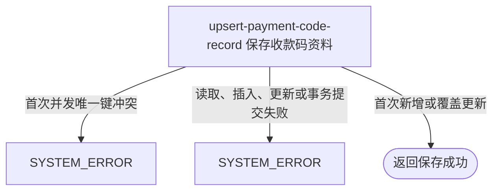

## 概要

新增或覆盖本人唯一的收款码扩展资料。

## 触发

登录用户已通过其他入口取得或准备好图片资源标识，并希望将其设为本人当前收款码时发起。首次保存与覆盖使用同一入口，固定维护一条 `wechat_payment_code` 扩展资料。

## 接口契约

### 请求参数

| 字段 | 类型 | 必填 | 约束 |
|---|---|---|---|
| `key` | 字符串 | 是 | 不可为 `null`、空串或纯空白；除此之外无格式和资源校验 |

### 成功响应

无业务数据；成功表示当前用户在固定扩展键下的 `extValue` 已变为本次 `key`。接口不返回资料业务编号、保存值、签名访问地址、是否首次创建或被替换的旧 key。

## 业务活动

- upsert-payment-code-record  生成新业务编号，按本人和固定扩展键新增或覆盖收款码资料

## 流程图

## 详细流程

1. 接收非空白图片资源标识，识别当前登录用户；不读取或校验基础账户和个人档案。
2. 将扩展键固定为 `wechat_payment_code`、扩展值设为请求 `key`。只校验字符串非空白，不检查是否为七牛 key、URL 或 base64，也不验证文件存在、归属、图片格式、大小和内容。
3. 每次请求都先为待保存记录生成新的雪花业务编号，再按当前用户和扩展键查询已有资料。
4. 没有资料时插入新行；已有资料时沿用数据库自增主键并整体更新，因此扩展值和业务编号都会替换，首次创建时间保留，更新时间刷新。
5. 覆盖时不读取或删除旧图片，不签发访问地址；旧资源可能长期成为无资料引用的外部文件。
6. 没有版本、锁或条件更新。并发首次保存由用户与扩展键唯一约束只允许一条成功；并发覆盖按写入顺序决定最终 key 和业务编号。
7. 返回成功但无业务数据，不交付新业务编号、当前 key 或签名地址。

## 异常分支

| 对外失败码 | 触发条件 | 由哪个活动报出 | 补偿动作或超时处理 | 对外提示 |
|---|---|---|---|---|
| 请求校验失败 | `key` 未提交、为 `null`、空串或纯空白 | 流程 | 不建立或修改资料 | key: 付款码 key 不能为空 |
| `PAYMENT_CODE_EMPTY` | 请求校验被绕过但领域层收到空白扩展值 | upsert-payment-code-record | 不建立或修改资料 | 收款码不能为空 |
| `SYSTEM_ERROR` | 两个首次保存同时插入，后到请求触发 `user_id + ext_key` 唯一键冲突 | upsert-payment-code-record | 事务回滚后到插入；先成功资料保留 | 系统异常，请稍后重试 |
| `SYSTEM_ERROR` | 唯一结果查询、插入、覆盖更新或事务提交失败 | upsert-payment-code-record | 事务回滚本次数据库变更 | 系统异常，请稍后重试 |

账户或档案不存在、资源不存在或不属于本人、key 不是图片或不是七牛资源标识都不是异常，仍按原字符串保存。覆盖不会删除旧图片。

## 技术线索

- HTTP 接口：`POST /user/payment-code`
- 事务入口：`PaymentCodeAppService.savePaymentCode`
- 固定扩展键：`wechat_payment_code`
- 数据表：`user_ext`
- upsert 定位：`user_id + ext_key`
- 业务编号：每次调用均为待保存 PO 新生成雪花 `biz_id`，覆盖时也替换
- 数据库约束：`uk_user_ext_key (user_id, ext_key)`、`uk_biz_id (biz_id)`
- 覆盖并发：按自增主键无版本 `updateById`，最后写入者生效
- 外部资源：本流程不调用七牛，不处理旧 key
