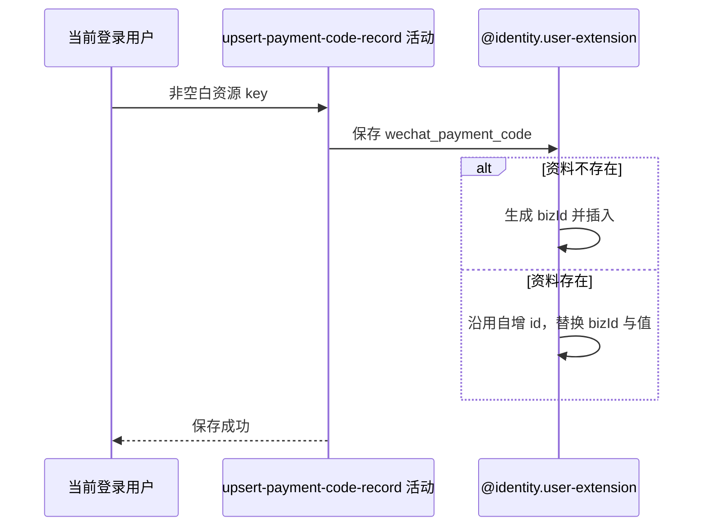

## 概要

生成新业务编号，按本人和固定扩展键新增或覆盖唯一收款码资料。

## 时序图

## 触发条件

登录用户提交 `POST /user/payment-code` 且 `key` 通过非空白校验后执行。

## 活动契约

入参为当前 `userId` 和非空白 `key`；扩展键固定为 `wechat_payment_code`。成功后该唯一扩展资料的值等于本次 key，无业务返回。

## 异常分支

| 错误标识 | 触发条件 | 处理 |
|---|---|---|
| 请求校验失败 | key 未提交或为空白 | 不进入活动 |
| `PAYMENT_CODE_EMPTY` | 绕过接口校验后领域仍收到空白值 | 不保存 |
| `SYSTEM_ERROR` | 首次并发插入唯一键冲突，或读取、插入、更新、提交失败 | 回滚本次数据库变更 |

## 领域依赖

### @identity.user-extension

- 输入：当前用户编号、固定扩展键与新的非空白值
- 输出：插入或覆盖唯一扩展资料，或返回校验、持久化失败

## 业务动作

A1 固定扩展键并校验值
A2 生成新业务编号并查询现有资料
A3 插入或覆盖唯一收款码记录

## 详细流程

1. `A1` 用户编号仅来自登录上下文，扩展键固定为 `wechat_payment_code`；接口和领域均校验 `key` 非空白，但不读取账户或个人档案。
2. 不校验该值是否为七牛 key、URL 或 base64，也不验证文件存在、归属、图片格式、大小和内容。
3. `A2` 每次调用都先为待保存记录生成新的雪花 `biz_id`，再按 `user_id + ext_key` 查询现有资料。
4. `A3` 无资料时插入；有资料时沿用数据库自增 `id` 整体更新，因此 `ext_value` 与 `biz_id` 都被替换，创建时间保留、更新时间刷新。
5. 覆盖时不读取或删除旧图片，也不签发访问地址；事务只覆盖数据库记录。
6. 无版本、锁或条件更新。并发首次保存由唯一键约束只允许一条成功；并发覆盖按最终写入顺序决定结果。

## 边界情况

- 账户或档案不存在不阻止以当前身份编号保存扩展资料。
- 格式错误、资源不存在或不属于本人的非空白字符串仍会原样保存。
- 覆盖后的旧资源可能成为无人引用的外部文件。
- 成功响应不披露是新增还是覆盖，也不返回新业务编号或签名地址。

## 实现提示

写入通过 `@identity.user-extension` 领域依赖表达，`reads` 为空且不声明写表。唯一键为 `user_id + ext_key`，当前 upsert 是先查后写，不是数据库原子 upsert。
