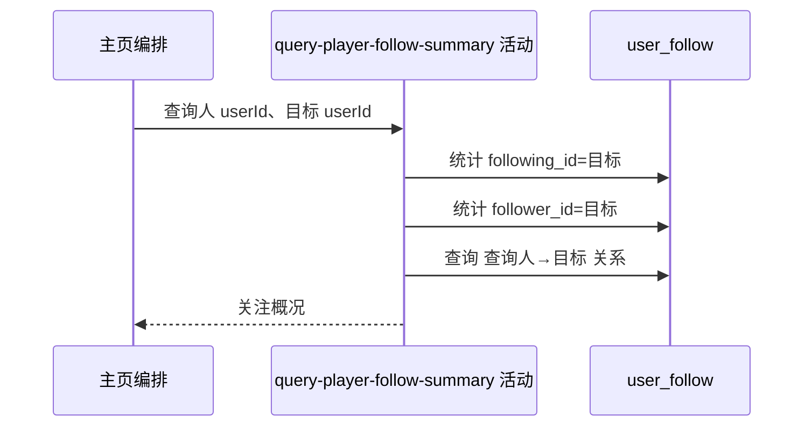

## 概要

统计目标球员的粉丝数、关注数及当前登录用户是否已关注目标。

## 时序图

## 触发条件

目标公开用户资料读取成功后执行。

## 活动契约

入参为查询人和目标用户编号；返回目标的粉丝数、关注数及 `isFollowed`。活动只读，不校验关系双方档案。

## 异常分支

| 错误标识 | 触发条件 | 处理 |
|---|---|---|
| `SYSTEM_ERROR` | 任一关注计数或关系查询失败 | 终止整份主页查询 |

## 领域依赖

无

## 业务动作

A1 统计目标粉丝数
A2 统计目标关注数
A3 判定查询人是否关注目标

## 详细流程

1. `A1` 按 `following_id=目标` 统计关系行数作为粉丝数。
2. `A2` 按 `follower_id=目标` 统计关系行数作为关注数。
3. `A3` 按 `follower_id=当前登录用户 AND following_id=目标` 判断是否存在关系。
4. 返回三个字段，不新建、删除或修复关注关系。

## 边界情况

- 没有任何关系时两个计数为 0、`isFollowed=false`。
- 查看本人时仍按同样关系查询；若数据库存在自关注行，可返回 true。
- 不因目标档案状态过滤关注关系。

## 实现提示

只读 `user_follow` 的关系端点列；三个查询独立执行，任一失败都会使主页整体失败。
