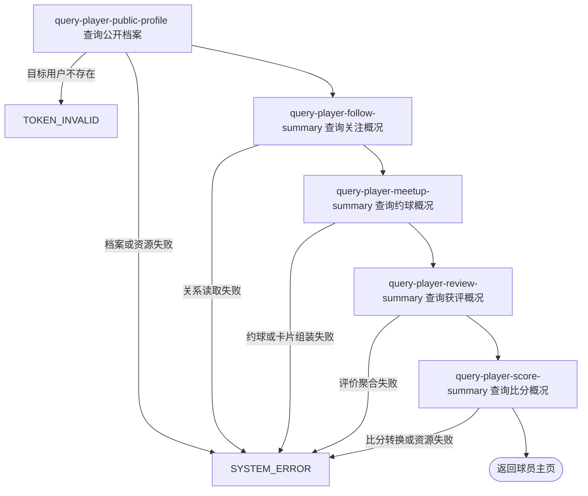

## 概要

聚合展示指定球员的公开资料、社交关系与近期表现。

## 触发

已登录用户查看指定球员公开主页时发起。可查询本人或任意存在的用户，不要求关注关系；接口实时串行聚合多个数据源，任一分组失败都会终止整份结果。

## 接口契约

### 路径参数

| 字段 | 类型 | 必填 | 约束 |
|---|---|---|---|
| `userId` | 字符串 | 是 | 目标基础用户必须存在；无额外格式与可见性校验 |

### 成功响应

| 分组 | 主要内容 |
|---|---|
| `user` | 用户编号、昵称、头像签名地址、性别、生日、城市编码、简介；城市名称为空 |
| `stats` | 粉丝数、关注数、当前登录用户是否已关注目标 |
| `meetup` | 完成态报名数量、最多三条最近非草稿约球卡片 |
| `review` | 获评总数、最多五个高频标签；三类明细计数字段为空 |
| `level` | NTRP、核查标记、新人标记 |
| `score` | 综合评级；无网球档案时为空字符串 |
| `video` | 全部视频、签名地址和封面；公开页不赋上传限制 |
| `setScore` | 全部盘数、单打数、双打数及最近十盘明细 |

头像、视频、封面和比分头像签名地址有效期为 3600 秒。主页不提供部分成功标志。

## 业务活动

- query-player-public-profile  读取并组装目标球员基础资料、等级、评级和视频
- query-player-follow-summary  汇总目标球员关注数量及当前用户关注状态
- query-player-meetup-summary  汇总完成约球数并组装最近约球卡片
- query-player-review-summary  汇总目标球员获评总数和高频标签
- query-player-score-summary  汇总盘级比分类型并组装最近十盘明细

## 流程图

## 详细流程

1. 确认查询人已登录，按路径中的目标用户编号读取该球员基础资料与可选网球档案；目标用户不存在时复用无效登录凭证错误，不自动建档，也不要求查询人关注对方。
2. 组装公开基础资料：交付用户编号、昵称、头像签名地址、性别、生日、城市编码和简介；不读取隐私开关，城市名称字段不赋值。
3. 分别统计目标球员粉丝数、关注数，并按当前登录用户与目标球员查询是否已关注；允许查看本人。
4. 已完成约球数只统计目标球员 `REVIEWED` 或 `SKIPPED` 报名。最近约球包含其创建的所有非草稿约球，或其 `JOINED`、`REVIEWED`、`SKIPPED` 报名对应的非草稿约球，按业务编号倒序多查一条后最多交付三张卡片。
5. 汇总目标球员收到的全部评价，`total` 为水平票、出勤票和拆分标签数之和，只交付最多五个高频标签；三个维度明细字段不赋值。
6. 有网球档案时返回 NTRP、核查标记、新人标记并按三项评分计算综合评级；无网球档案时等级对象字段为空、评级为空字符串。档案存在但评分为空时计算可能失败，不按待完善状态降级。
7. 返回档案中的全部视频及一小时视频、封面签名地址；标题空白显示“未命名”。无档案或视频列表为空时返回数量零和空列表，公开主页的视频限制字段不赋值。
8. 查询目标球员出现在任一位置的全部盘级比分，`total` 包含所有类型，另统计单打和双打数；按业务编号倒序取前十条，交付类型、盘制、`MM-dd` 日期、双方编号、头像、性别、主分和抢七分，不交付昵称。
9. 比分胜负先判断目标球员是否在 A 侧，同时出现在两侧时按 A 侧；持久化胜方与该侧一致才为胜，否则为负。任一子聚合或资源处理失败都会终止整份主页查询。

## 异常分支

| 对外失败码 | 触发条件 | 由哪个活动报出 | 补偿动作或超时处理 | 对外提示 |
|---|---|---|---|---|
| `TOKEN_INVALID` | 指定 `userId` 没有对应基础用户 | query-player-public-profile | 只读，无需补偿 | 登录凭证无效，请重新登录 |
| `SYSTEM_ERROR` | 存在网球档案但三项评分任一为空，或档案数据、配置无法处理 | query-player-public-profile | 只读，无需补偿 | 系统异常，请稍后重试 |
| `SYSTEM_ERROR` | 非空头像或视频无法签名，非空视频 key 无扩展名 | query-player-public-profile | 只读，无需补偿 | 系统异常，请稍后重试 |
| `SYSTEM_ERROR` | 关注关系查询失败 | query-player-follow-summary | 只读，无需补偿 | 系统异常，请稍后重试 |
| `SYSTEM_ERROR` | 约球、报名、球场资料读取或最近卡片组装失败 | query-player-meetup-summary | 只读，无需补偿 | 系统异常，请稍后重试 |
| `SYSTEM_ERROR` | 评价类型、标签值或评价读取异常 | query-player-review-summary | 只读，无需补偿 | 系统异常，请稍后重试 |
| `SYSTEM_ERROR` | 比分日期为空、枚举无法转换、头像签名或比分读取失败 | query-player-score-summary | 只读，无需补偿 | 系统异常，请稍后重试 |

没有网球档案、关注、约球、评价、视频或比分都不是异常，对应对象按空字段、零计数或空列表返回。无网球档案与“存在但评分为空”的处理不同：前者可成功，后者可能使整页失败。

## 技术线索

- HTTP 接口：`GET /user/profile/{userId}`
- 聚合入口：`PlayerHomeAppService.getPlayerHome`
- 查询人：仅调用 `UserContext.get` 校验登录；目标档案由路径用户编号读取
- 公开资料：未赋 `cityName`，无隐私开关
- 最近约球：非草稿；发布者或 `JOINED`、`REVIEWED`、`SKIPPED`；`biz_id DESC`；SQL 取 4、交付 3
- 完成数：报名 `REVIEWED`、`SKIPPED`
- 获评汇总：复用 `UserReviewDomainService.getReviewSummary(target, 5)`
- 评级：`ProfileLevelManager.calculate`；无档案返回空字符串
- 视频：全部交付，空白标题为“未命名”，封面替换最后扩展名为 `.jpg`
- 比分：本人四位置任一匹配，`biz_id DESC`；总数含全部类型，最近固定 10
- 比分胜负：A 侧优先，仅 A+`A` 或非 A+`B` 为胜
