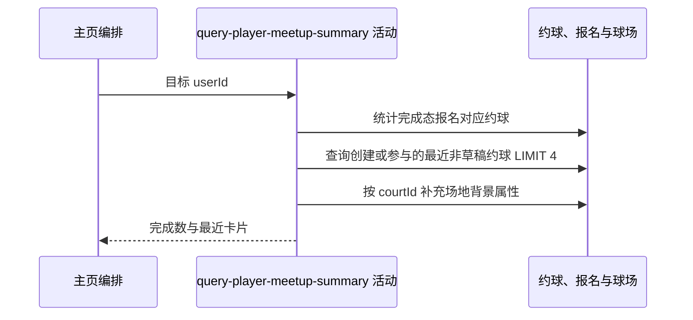

## 概要

统计目标球员的完成约球数，并组装最多三张最近非草稿约球卡片。

## 时序图

## 触发条件

公开资料和关注概况读取成功后执行。

## 活动契约

入参为目标用户编号；返回完成约球数量及按业务编号倒序的最近约球卡片，最多三张。活动只读。

## 异常分支

| 错误标识 | 触发条件 | 处理 |
|---|---|---|
| `SYSTEM_ERROR` | 约球、报名、球场读取或卡片枚举/背景转换失败 | 终止整份主页查询 |

## 领域依赖

无

## 业务动作

A1 统计完成态报名对应约球
A2 查询最近非草稿约球
A3 组装最近约球卡片

## 详细流程

1. `A1` 统计目标用户报名状态为 `REVIEWED/SKIPPED` 且约球非 `DRAFT` 的记录，不再检查约球时间或终态。
2. `A2` 最近集合包含目标创建的非草稿约球，以及其报名为 `JOINED/REVIEWED/SKIPPED` 的非草稿约球；按 `biz_id DESC`，无游标请求 4 条。
3. `A3` 将返回集合转换为 `RECENT` 卡片；主标签采用有效状态文案，OPEN 且结束时间已过时展示 FINISHED 文案。
4. 有 `court_id` 时读取球场材质和室内外属性，结合开球时段解析背景；天气固定按缺失降级。
5. 上游约定最多交付三张卡片；当前底层请求 4 条用于该上限口径，不返回游标。

## 边界情况

- 目标既是创建者又有报名记录时由 EXISTS 条件自然只返回一条约球。
- 草稿始终排除；取消、关闭、已结束等非草稿状态仍可进入最近集合。
- 球场不存在时背景按未知材质/环境降级，不是业务错误。
- 完成数量转为整数，极端超过整数范围可能溢出。

## 实现提示

只读表列按当前 DB snapshot 声明；最近查询 SQL 取 4，而产品契约为最多 3，保持此实现差异可见。
