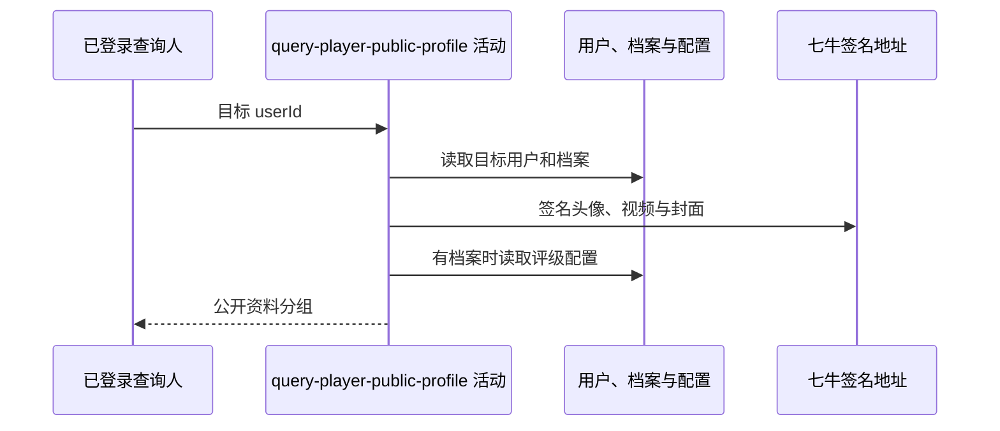

## 概要

读取目标球员基础资料与可选网球档案，组装公开用户、等级、评级和视频分组。

## 时序图

## 触发条件

已登录用户调用 `GET /user/profile/{userId}` 后首先执行。

## 活动契约

入参为路径目标 `userId`；返回公开基础资料、等级、综合评级和视频。目标用户必须存在，网球档案可不存在；活动只读。

## 异常分支

| 错误标识 | 触发条件 | 处理 |
|---|---|---|
| `TOKEN_INVALID` | 目标基础用户不存在 | 终止整份主页查询，不自动建档 |
| `SYSTEM_ERROR` | 档案、评分配置或非空资源签名/封面处理失败 | 终止整份主页查询 |

## 领域依赖

无

## 业务动作

A1 读取目标用户与可选网球档案
A2 组装公开基础资料
A3 组装等级与综合评级
A4 组装全部公开视频

## 详细流程

1. `A1` 查询人只需通过登录校验；按路径用户编号读取目标基础用户和可选档案，不要求关注关系。目标用户不存在复用 `TOKEN_INVALID`。
2. `A2` 返回用户编号、昵称、头像一小时签名地址、性别、生日、城市编码和简介；不读取隐私开关，也不赋城市名称。
3. `A3` 无档案时返回字段为空的等级对象及空字符串评级；有档案时返回 NTRP、核查标记、新人标记，并按三项评分与配置阈值计算综合评级，不因 TBC 状态降级。
4. `A4` 无档案或视频列表为空时返回数量 0 和空列表；否则返回全部视频，为视频和 `.jpg` 封面生成一小时签名地址，空白标题显示“未命名”。公开页不赋上传限制。
5. 输出四个分组供后续聚合，不修改目标资料。

## 边界情况

- 可查询本人；路径用户与登录用户可以相同。
- 无档案可成功，但存在档案且评分为空可能使评级计算失败。
- 非空视频 key 无扩展名时封面构造可能失败。
- 城市编码原样返回，城市名称保持 null。

## 实现提示

只读列按当前 DB snapshot 声明；七牛 RPC snapshot 当前缺失，资源签名行为按现有 Java 确认。
