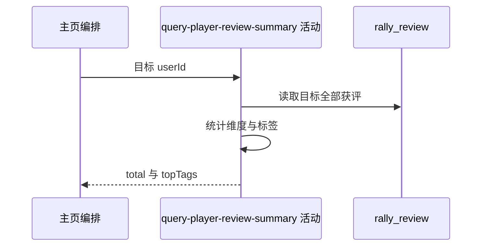

## 概要

汇总目标球员收到的全部评价，返回总数与最多五个高频标签。

## 时序图

## 触发条件

约球概况读取成功后执行。

## 活动契约

入参为目标用户编号；返回水平票、出勤票与标签出现数之和 `total`，以及最多五个高频标签。主页不交付三类明细计数；活动只读。

## 异常分支

| 错误标识 | 触发条件 | 处理 |
|---|---|---|
| `SYSTEM_ERROR` | 评价类型转换、null 标签值或持久化读取失败 | 终止整份主页查询 |

## 领域依赖

无

## 业务动作

A1 读取目标全部获评
A2 汇总评价总数
A3 聚合最多五个高频标签

## 详细流程

1. `A1` 按 `to_user_id=目标` 读取全部历史评价，不限时间、约球状态，不按评价人或约球去重。
2. `A2` 水平票和出勤票按记录数统计；TAG 按英文逗号拆分，原始非空片段计入标签数，三者相加为 `total`。
3. `A3` 标签去首尾空白、排除空值后按名称累计，同条重复也重复计数；次数降序取前五，同次数无稳定次级排序。
4. 主页只赋 `total` 和标签列表，水平票、出勤票、标签三个明细字段保持 null。

## 边界情况

- 无评价返回 total=0 和空标签列表。
- 纯空格片段增加 total，但不会作为高频标签展示。
- 不检查目标是否有网球档案。

## 实现提示

与本人获评汇总复用同一内存聚合口径，但主页仅投影总数与前五标签。
