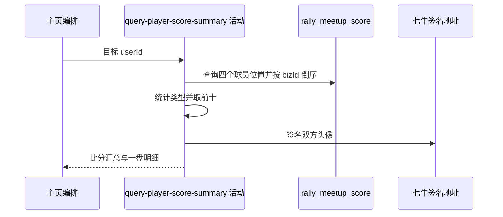

## 概要

汇总目标球员的盘级比分类型数量，并组装按业务编号倒序的最近十盘。

## 时序图

## 触发条件

评价概况读取成功后执行，是主页聚合的最后一个活动。

## 活动契约

入参为目标用户编号；返回全部盘数、单打数、双打数及最近十盘双方视图。活动只读，不返回拉球单独计数或球员昵称。

## 异常分支

| 错误标识 | 触发条件 | 处理 |
|---|---|---|
| `SYSTEM_ERROR` | 比分日期为空、枚举转换、头像签名或比分读取失败 | 终止整份主页查询 |

## 领域依赖

无

## 业务动作

A1 查询目标全部盘级比分
A2 统计总数及单打双打数量
A3 转换最近十盘双方明细

## 详细流程

1. `A1` 查询目标出现在四个球员位置任一处的全部比分并按 `biz_id DESC`；不读取账户、档案或约球。
2. `A2` `total` 统计全部类型，包括 `RALLY`；另分别统计 `SINGLE` 与 `DOUBLE`，不返回拉球单独计数。
3. `A3` 取倒序前十条。目标在 A 侧任一位置即视为 A 侧，跨侧重复也优先 A；`win_side` 与目标侧一致才判胜，不按分数重算。
4. 每盘返回类型、盘制、`MM-dd` 日期、双方球员编号、性别、主分和抢七分；头像由保存时快照生成一小时签名地址，不返回昵称。
5. 返回汇总，不修改比分或用户评分。

## 边界情况

- 无比分时三个计数为 0、明细为空。
- 双打空位和抢七空值保留 null。
- RALLY 计入 total，但不计入单打或双打数。
- 非空头像签名失败会使整份主页失败。

## 实现提示

只读列按当前 DB snapshot 精确声明；全量读取后在内存统计并截前十。七牛 RPC snapshot 当前缺失。
