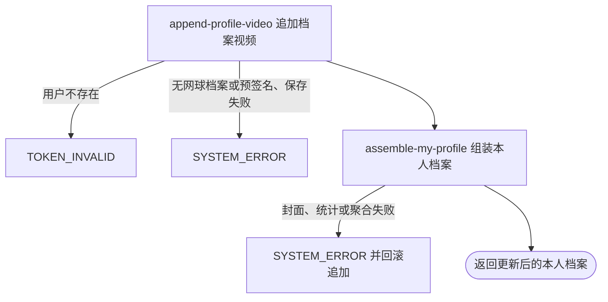

## 概要

追加一项本人档案视频并返回更新后的聚合档案。

## 触发

登录用户已通过其他服务上传视频，随后把该资源加入本人展示档案时发起。一次请求只追加一项，不替换或去重，并在保存后返回本人聚合档案。

## 接口契约

### 请求参数

| 字段 | 类型 | 必填 | 约束 |
|---|---|---|---|
| `key` | 字符串 | 是 | 不可为空白；除此之外无资源与格式校验 |
| `title` | 字符串 | 否 | 原样保存；空白值在完整档案中展示为“未命名” |

### 成功响应

返回与“我的档案”同结构的聚合结果。`TBC` 状态只返回状态和基础资料，`video` 为 `null`；`NORMAL`、`UNDER_REVIEW` 返回追加后的完整视频列表、3600 秒签名地址、封面地址及展示用数量/大小/时长限制。响应不标识本次新增项。

## 业务活动

- append-profile-video  将视频 key 与标题追加到本人网球档案的完整视频列表
- assemble-my-profile  重新读取并组装追加后的本人聚合档案

## 流程图

## 详细流程

1. 接收非空白视频资源标识和可选标题，识别当前登录用户并读取基础用户与网球档案；用户不存在按无效身份拒绝，没有网球档案时因无法追加而系统异常，不自动建档。
2. 尝试为请求 key 生成七牛签名地址以检查构址能力；该操作不访问文件，不验证存在、上传完成、视频类型、归属、大小或时长。
3. 网球档案视频列表为空时先建立空列表，再把 key 与标题原样追加到末尾。不执行数量上限和重复 key 校验，空白标题也原样保存。
4. 保存完整视频列表，保持档案状态、NTRP、三项评分、核查标记和其他字段不变。
5. 在同一事务内重新聚合本人档案。`TBC` 只返回状态和基础资料，不展示刚新增视频；`NORMAL` 或 `UNDER_REVIEW` 返回视频、封面、统计、等级和评分。
6. 正常或核查期下，新增或既有非空视频 key 无扩展名会在生成 `.jpg` 封面时失败；任何聚合失败都会回滚视频追加。`TBC` 不构建视频分组，因此同样 key 可以保存成功。
7. 返回更新后的聚合档案，不上传文件，也不返回单独的视频新增结果。

## 异常分支

| 对外失败码 | 触发条件 | 由哪个活动报出 | 补偿动作或超时处理 | 对外提示 |
|---|---|---|---|---|
| 请求校验失败 | `key` 未提交、为 `null`、空串或纯空白 | 流程 | 不修改视频列表 | key: 视频 key 不能为空 |
| `TOKEN_INVALID` | 当前登录身份没有基础用户 | append-profile-video | 不创建用户或档案 | 登录凭证无效，请重新登录 |
| `SYSTEM_ERROR` | 有用户但没有网球档案 | append-profile-video | 不自动建档，不修改资料 | 系统异常，请稍后重试 |
| `SYSTEM_ERROR` | 请求 key 无法按当前七牛配置生成签名地址，或档案保存失败 | append-profile-video | 事务回滚视频列表更新 | 系统异常，请稍后重试 |
| `SYSTEM_ERROR` | 完整档案中的非空视频 key 无扩展名，或头像、视频、封面签名失败 | assemble-my-profile | 事务回滚本次追加 | 系统异常，请稍后重试 |
| `SYSTEM_ERROR` | 城市、关注、约球、评分、配置或其他聚合依赖失败 | assemble-my-profile | 事务回滚本次追加 | 系统异常，请稍后重试 |

重复 key、空白标题、超过展示限制、文件不存在、不属于本人或不是视频都不是异常。无扩展名 key 在 `TBC` 可保存成功，因为响应不构建视频分组；在 `NORMAL`、`UNDER_REVIEW` 会因封面生成失败而回滚。

## 技术线索

- HTTP 接口：`POST /user/profile/video/upload`
- 事务入口：`ProfileAppService.uploadVideo`
- 请求预处理：`QiniuConfiguration.buildSignedUrl(cmd.key)`，不访问文件
- 追加行为：`TennisProfileData.addVideo`，列表为空时初始化
- 持久化：完整 `videos` 列表序列化为 JSON
- 未使用限制：`user.video.max_count`、`max_size_mb`、`max_second` 仅在响应展示
- 返回聚合：同步调用 `MyProfileAppService.getMyProfile`
- 封面规则：把最后一个扩展名替换为 `.jpg`
