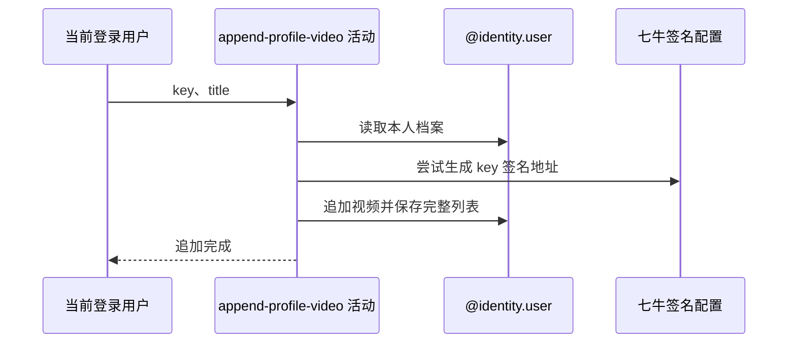

## 概要

把请求的视频 key 与标题追加到本人网球档案视频列表并保存。

## 时序图

## 触发条件

请求 `POST /user/profile/video/upload` 的 key 通过非空白校验后执行。

## 活动契约

入参为当前 `userId`、非空白 key 和可选 title；在现有档案视频列表末尾追加一项并保存，不上传文件、不去重、不返回单项结果。

## 异常分支

| 错误标识 | 触发条件 | 处理 |
|---|---|---|
| `TOKEN_INVALID` | 当前基础用户不存在 | 不创建用户或档案 |
| `SYSTEM_ERROR` | 网球档案不存在、签名构址或档案保存失败 | 事务回滚，不自动建档 |

## 领域依赖

### @identity.user

- 输入：当前用户、待追加视频及保持其他档案字段不变的意图
- 输出：保存追加后的完整视频列表，或返回身份/持久化失败

## 业务动作

A1 读取本人网球档案
A2 预检资源签名构址
A3 追加视频并保存完整列表

## 详细流程

1. `A1` 按登录用户读取基础用户和档案；用户不存在报 `TOKEN_INVALID`，有用户无档案按 `SYSTEM_ERROR`，不初始化。
2. `A2` 对请求 key 尝试生成签名地址，只验证当前配置能否构址，不访问或验证文件。
3. `A3` 列表为 null 时先建空列表，再把 key/title 原样追加到末尾；不校验数量上限或重复 key。
4. 保存完整 JSON 列表，保持状态、NTRP、评分和核查字段不变，交给后续档案聚合。

## 边界情况

- 空白标题原样保存，展示时才变成“未命名”。
- 文件不存在、不属于本人、不是视频或超过展示限制仍可保存。
- 无扩展名 key 可通过签名预检；后续完整档案封面构造可能失败。

## 实现提示

写入由 `@identity.user` 表达，`reads` 为空；展示限制配置没有参与追加校验。七牛 RPC snapshot 当前缺失。
