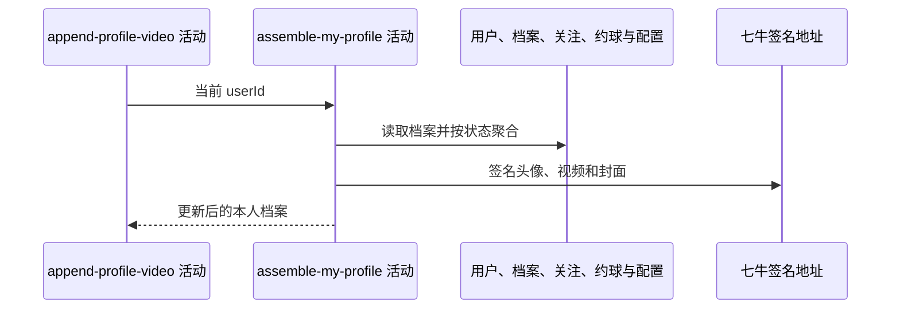

## 概要

重新读取追加后的本人档案，组装基础资料及完整档案分组。

## 时序图

## 触发条件

上游视频列表保存后、同一事务提交前执行。

## 活动契约

入参为当前 `userId`；返回与“我的档案”一致的聚合结果。`NONE/TBC` 只交付状态和基础资料，`NORMAL/UNDER_REVIEW` 交付统计、等级、评分和视频。

## 异常分支

| 错误标识 | 触发条件 | 处理 |
|---|---|---|
| `TOKEN_INVALID` | 重新读取不到当前用户 | 终止并回滚上游追加 |
| `SYSTEM_ERROR` | 城市、档案、统计、配置、签名或封面处理失败 | 终止并回滚上游追加 |

## 领域依赖

无

## 业务动作

A1 读取档案并判定完整状态
A2 组装基础资料与头像
A3 组装统计、等级和评分
A4 组装完整视频列表与展示限制

## 详细流程

1. `A1-A2` 重新读取用户与档案，组装头像一小时签名地址和城市名称；用户不存在时报错。
2. `NONE/TBC` 直接返回基础分组，`video` 等完整分组为 null，因此刚追加视频不会在 TBC 响应中展示。
3. `A3` 完整档案统计关注与完成约球，计算 NTRP 提示和综合评级。
4. `A4` 遍历追加后的全部视频，为 key 和 `.jpg` 封面签名，空白标题显示“未命名”，并读取数量、大小、时长展示限制。
5. 任一聚合失败向上传播，使同一事务中的视频追加回滚。

## 边界情况

- TBC 下无扩展名 key 可保存成功，因为不构建视频分组。
- NORMAL/UNDER_REVIEW 下任何新旧视频 key 无扩展名都可能导致封面失败并回滚追加。
- 展示限制只返回给客户端，不截断已经保存的视频列表。

## 实现提示

精确只读表列按当前 DB snapshot 声明；聚合虽只读，但其失败决定上游写事务能否提交。
