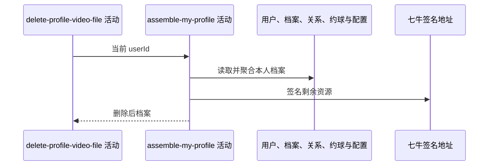

## 概要

重新读取删除后的本人档案并组装聚合返回。

## 时序图

## 触发条件

档案列表已更新且外部文件删除成功后、事务提交前执行。

## 活动契约

入参为当前用户；按档案状态返回基础或完整聚合结果。活动只读，但失败会回滚列表更新，无法恢复已删除文件。

## 异常分支

| 错误标识 | 触发条件 | 处理 |
|---|---|---|
| `TOKEN_INVALID` | 重新读取不到用户 | 回滚列表，文件不恢复 |
| `SYSTEM_ERROR` | 城市、统计、评分、配置、签名或封面失败 | 回滚列表，文件不恢复 |

## 领域依赖

无

## 业务动作

A1 读取并判定档案状态
A2 组装基础资料
A3 组装完整统计、等级、评分与剩余视频

## 详细流程

1. 重新读取本人用户和档案，组装头像与城市。
2. `NONE/TBC` 只返回基础分组；`NORMAL/UNDER_REVIEW` 才统计关系、完成约球并计算等级、评分。
3. 完整档案遍历删除后的全部视频，生成一小时视频/封面地址和展示限制。
4. 任一失败向上传播并回滚数据库列表；先前物理删除的文件无法恢复。

## 边界情况

- TBC 响应不展示剩余视频。
- 重复 key 全删后空列表可在完整档案中返回 total=0。
- 剩余任一无扩展名 key 仍可使封面组装失败。

## 实现提示

精确只读表列按 DB snapshot 声明；此活动揭示数据库与对象存储无法原子提交的风险。
