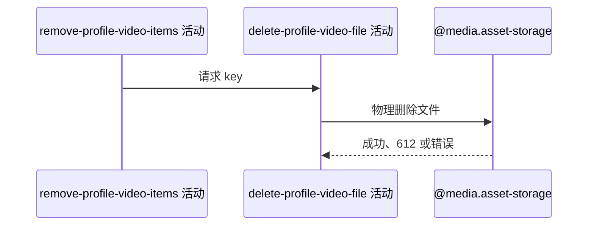

## 概要

把档案删除请求中的 key 原样交给七牛执行物理文件删除。

## 时序图

## 触发条件

上游档案视频列表保存成功后执行。

## 活动契约

入参为请求 key；不校验目录、归属或登记状态，物理删除对应七牛文件。文件不存在码 612 视为成功。

## 异常分支

| 错误标识 | 触发条件 | 处理 |
|---|---|---|
| `SYSTEM_ERROR` | 七牛返回除 612 外的错误 | 终止流程并回滚上游列表；外部实际状态不补偿 |

## 领域依赖

### @media.asset-storage

- 输入：待物理删除的原始资源 key
- 输出：删除成功、文件已不存在或外部失败

## 业务动作

A1 请求物理删除视频文件
A2 解释文件不存在结果

## 详细流程

1. `A1` 将 key 原样传给七牛，不检查 `videos/{userId}/` 前缀、资源类型或所有权。
2. `A2` 正常删除或 612 都继续；其他错误向上传播，使数据库列表更新回滚。
3. 外部删除不参加数据库事务，后续聚合或提交失败无法恢复文件。

## 边界情况

- key 未登记仍可能删除一个真实外部文件。
- 数据库回滚与文件恢复不等价，可能形成失效引用。
- 删除请求的空白校验发生在流程入口。

## 实现提示

外部副作用通过 `@media.asset-storage` 表达；七牛 RPC snapshot 当前缺失，612 容错按 Java 客户端确认。
