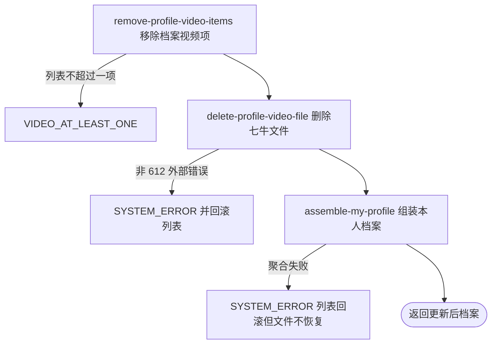

## 概要

从本人档案移除同 key 视频、删除文件并返回聚合档案。

## 触发

登录用户从档案视频管理入口删除一项视频时发起；请求非空白 key，成功后返回本人聚合档案。

## 接口契约

请求：`key` 字符串，必填且不可空白；不校验本人目录前缀或已登记。成功返回与“我的档案”同结构的聚合结果；`TBC` 的 `video` 为空，正常或核查期返回删除后列表。

## 业务活动

- remove-profile-video-items  校验删除前数量并从档案移除全部同 key 项
- delete-profile-video-file  物理删除请求 key 对应七牛文件
- assemble-my-profile  组装删除后的本人聚合档案

## 流程图

## 详细流程

1. 接收非空白 key，识别当前用户并读取基础用户与网球档案；用户不存在按无效身份拒绝，无网球档案时解引用失败，不自动创建。
2. 删除前要求视频列表非空且条目数大于一；只检查删除前数量，不检查目标 key 是否存在或删除后剩余数量。
3. 从列表移除所有 key 完全相等的项；目标不存在时列表不变，重复 key 会一次移除全部，可能把列表删空。
4. 保存完整视频列表后，把请求 key 原样交给七牛物理删除；不校验本人目录前缀、档案归属或资源类型，文件不存在返回码 612 视为成功。
5. 在同一数据库事务内聚合本人档案并返回。七牛不参加事务：文件删除成功后聚合失败会回滚列表，但无法恢复文件，形成失效引用。
6. `TBC` 成功时只返回状态和基础资料，不展示剩余视频；正常或核查期会组装全部剩余视频、封面、统计、等级和评分。

## 异常分支

| 对外失败码 | 触发条件 | 由哪个活动报出 | 补偿动作或超时处理 | 对外提示 |
|---|---|---|---|---|
| 请求校验失败 | `key` 为空白 | 流程 | 不修改列表或文件 | key: 视频 key 不能为空 |
| `TOKEN_INVALID` | 基础用户不存在 | remove-profile-video-items | 不创建资料 | 登录凭证无效，请重新登录 |
| `VIDEO_AT_LEAST_ONE` | 删除前列表为空或不超过一项 | remove-profile-video-items | 不修改列表或文件 | 至少需要保留一个视频 |
| `SYSTEM_ERROR` | 无网球档案、列表解析或保存失败 | remove-profile-video-items | 事务回滚列表 | 系统异常，请稍后重试 |
| `SYSTEM_ERROR` | 七牛删除返回非 612 错误 | delete-profile-video-file | 事务回滚列表；外部状态以七牛为准 | 系统异常，请稍后重试 |
| `SYSTEM_ERROR` | 返回档案的城市、统计、评分、封面或签名处理失败 | assemble-my-profile | 事务回滚列表；已删除文件不恢复 | 系统异常，请稍后重试 |

目标 key 未登记仍删除外部文件并成功；重复 key 全部移除，删除后可能为空。七牛 612 视为已删除。

## 技术线索

- HTTP：`POST /user/profile/video/delete`
- 事务：`ProfileAppService.deleteVideo`
- 数量断言：删除前 `videos.size() > 1`
- 列表删除：`removeIf(key.equals)`，无命中检查
- 外部删除：列表保存后调用七牛，612 忽略
- 返回：同步 `MyProfileAppService.getMyProfile`
