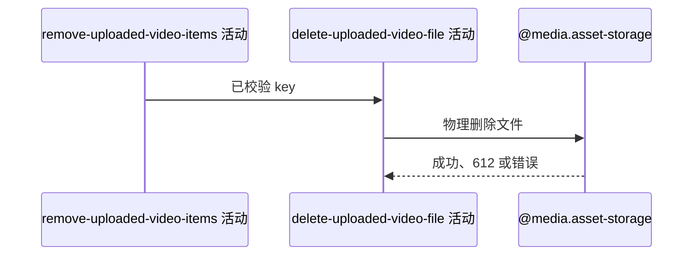

## 概要

物理删除已经通过本人视频目录前缀校验的七牛文件。

## 时序图

## 触发条件

上传资源流程的档案视频列表更新成功后执行。

## 活动契约

入参为已通过 `videos/{userId}/` 前缀校验的 key；物理删除文件，612 视为成功。成功无业务数据。

## 异常分支

| 错误标识 | 触发条件 | 处理 |
|---|---|---|
| `SYSTEM_ERROR` | 七牛返回除 612 外的错误或事务提交失败 | 数据库列表回滚；外部实际状态无法补偿 |

## 领域依赖

### @media.asset-storage

- 输入：已通过本人目录前缀校验的资源 key
- 输出：删除成功、文件不存在或外部失败

## 业务动作

A1 删除本人目录文件
A2 完成数据库事务

## 详细流程

1. `A1` 把 key 交给七牛删除；正常结果或 612 均视为成功。
2. 其他错误向上传播并回滚上游列表变更。
3. `A2` 外部删除后提交数据库事务；若提交失败，文件不可恢复而列表会回滚。
4. 成功返回空业务数据，不重新读取个人档案。

## 边界情况

- 文件不存在仍返回成功。
- 前缀合法但未登记的文件仍会被删除。
- 七牛成功与数据库提交之间没有补偿或幂等记录。

## 实现提示

外部副作用通过 `@media.asset-storage` 表达，`reads` 为空；七牛 RPC snapshot 当前缺失。
