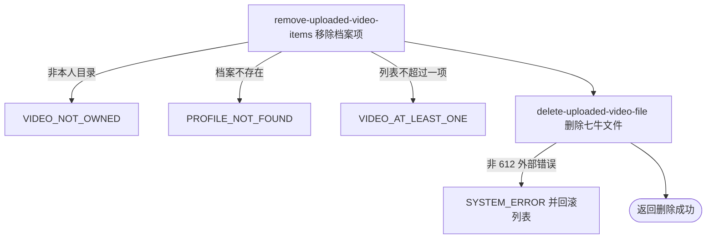

## 概要

删除本人视频目录中的指定文件及对应档案项。

## 触发

登录用户从上传资源管理入口删除本人视频目录中的文件时发起；成功只返回确认，不聚合档案。

## 接口契约

查询参数 `key` 必填，必须以 `videos/{当前用户编号}/` 开头。成功无业务数据；不返回视频列表或个人档案。

## 业务活动

- remove-uploaded-video-items  校验目录与删除前数量，从档案移除全部同 key 项
- delete-uploaded-video-file  物理删除本人目录中的七牛文件

## 流程图

## 详细流程

1. 从查询参数接收 key 并识别当前用户；直接调用字符串前缀判断，参数缺失由框架拒绝，`null` 不进入服务，非本人 `videos/{userId}/` 前缀以无权操作拒绝。
2. 按当前用户读取网球档案，不读取基础用户；档案不存在以 `PROFILE_NOT_FOUND` 拒绝。视频列表为 `null` 时按空列表处理。
3. 删除前要求列表条目数大于一；不确认目标 key 在列表内，也不计算移除后是否仍有一项。
4. 从列表移除所有相同 key 项并保存完整列表；目标不存在时保存原列表，重复 key 可能全部移除并使列表为空。
5. 把已通过本人目录前缀的 key 交给七牛物理删除；文件不存在返回码 612 视为成功，其他外部失败使数据库事务回滚。
6. 返回成功但无业务数据，不聚合个人档案。七牛不参加事务，文件成功删除后若事务提交失败，列表可回滚而文件无法恢复。

## 异常分支

| 对外失败码 | 触发条件 | 由哪个活动报出 | 补偿动作或超时处理 | 对外提示 |
|---|---|---|---|---|
| 请求参数错误 | `key` 缺失 | 流程 | 不修改列表或文件 | 按框架必填参数错误返回 |
| `VIDEO_NOT_OWNED` | key 不以本人视频目录前缀开头 | remove-uploaded-video-items | 不修改列表或文件 | 无权操作该视频 |
| `PROFILE_NOT_FOUND` | 本人网球档案不存在 | remove-uploaded-video-items | 不创建档案 | 档案不存在 |
| `VIDEO_AT_LEAST_ONE` | 删除前列表为空或不超过一项 | remove-uploaded-video-items | 不修改列表或文件 | 至少需要保留一个视频 |
| `SYSTEM_ERROR` | 列表解析、保存或七牛非 612 删除失败 | 相应活动 | 数据库事务回滚；外部文件无法事务恢复 | 系统异常，请稍后重试 |

目标未登记仍保存原列表并删除文件；重复 key 全部移除且删除后不复核。七牛 612 视为成功。

## 技术线索

- HTTP：`DELETE /user/upload/video?key=...`
- 事务：`VideoAppService.deleteVideo`
- 前缀：`videos/{userId}/`
- 数量断言与删除：删除前大于一，随后 `removeIf`
- 持久化：只更新完整 videos JSON
- 返回：通用成功，`data=null`
