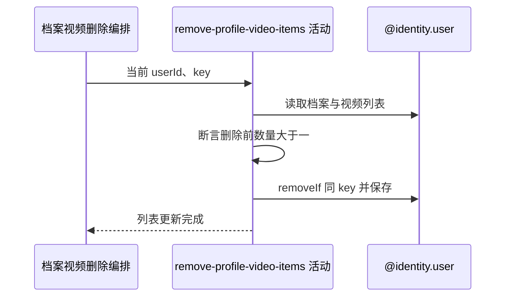

## 概要

校验删除前视频数量，从本人档案移除全部同 key 项并保存。

## 时序图

## 触发条件

`POST /user/profile/video/delete` 的 key 通过非空白校验后执行。

## 活动契约

入参为当前用户和 key；要求删除前列表条目数大于一，随后移除全部完全相等 key 并保存完整列表。不要求 key 已登记。

## 异常分支

| 错误标识 | 触发条件 | 处理 |
|---|---|---|
| `TOKEN_INVALID` | 基础用户不存在 | 不创建资料 |
| `VIDEO_AT_LEAST_ONE` | 删除前列表为空或条目不超过一 | 不修改列表 |
| `SYSTEM_ERROR` | 无网球档案、列表解析或保存失败 | 回滚列表变更 |

## 领域依赖

### @identity.user

- 输入：当前用户、目标 key 与保留至少一项的删除意图
- 输出：保存移除后的完整视频列表或业务失败

## 业务动作

A1 读取并校验删除前列表
A2 移除全部同 key 项
A3 保存完整列表

## 详细流程

1. `A1` 读取当前用户档案；用户不存在报 `TOKEN_INVALID`，无网球档案会解引用失败。
2. 仅断言删除前 `videos != null && size > 1`，不确认目标存在，也不计算删除后数量。
3. `A2-A3` 用 key 完全相等移除全部匹配项并保存；无命中时仍保存原列表。
4. 成功后进入外部文件删除，数据库事务尚未提交。

## 边界情况

- 重复 key 会一次全部移除，删除后可以为空。
- 未登记 key 不改列表，但仍会进入外部删除。
- 不校验资源目录、归属或类型。

## 实现提示

写入通过 `@identity.user` 表达，`reads` 为空；数量规则基于删除前而非删除后。
