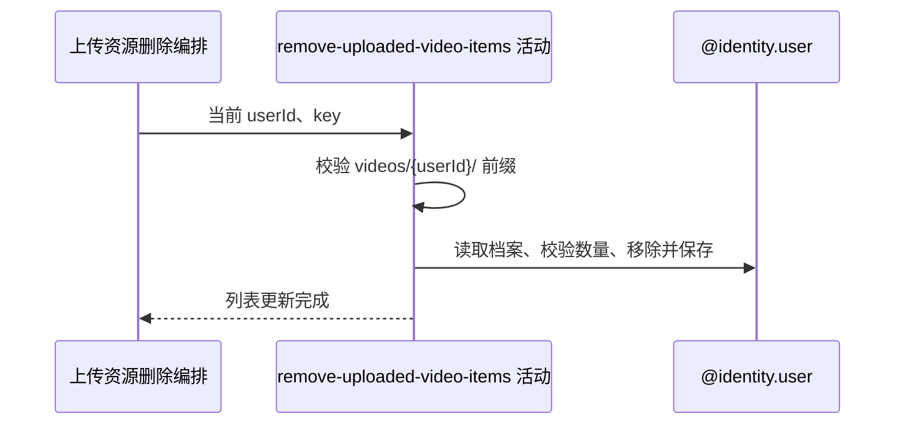

## 概要

校验本人视频目录与删除前数量，从网球档案移除全部同 key 项并保存。

## 时序图

## 触发条件

调用 `DELETE /user/upload/video?key=...` 且框架取得必填 key 后执行。

## 活动契约

入参为当前用户和 key；key 必须以本人视频目录开头，档案必须存在且删除前列表多于一项，然后移除全部同 key 项并保存。

## 异常分支

| 错误标识 | 触发条件 | 处理 |
|---|---|---|
| `VIDEO_NOT_OWNED` | key 不以 `videos/{userId}/` 开头 | 不读写档案 |
| `PROFILE_NOT_FOUND` | 网球档案不存在 | 不创建档案 |
| `VIDEO_AT_LEAST_ONE` | 删除前列表不超过一项 | 不修改列表 |
| `SYSTEM_ERROR` | 列表解析或保存失败 | 回滚列表 |

## 领域依赖

### @identity.user

- 输入：当前用户、已通过目录校验的 key 与删除意图
- 输出：保存移除后的网球档案视频列表或业务失败

## 业务动作

A1 校验本人资源目录
A2 读取档案并校验删除前数量
A3 移除全部匹配项并保存

## 详细流程

1. `A1` 直接判断 key 是否以 `videos/{当前用户编号}/` 开头，不规范化路径。
2. `A2` 只读取网球档案；不存在报 `PROFILE_NOT_FOUND`，null 列表转为空列表，再断言删除前 size>1。
3. `A3` 移除全部同 key 项并更新完整 JSON；无命中时保存原列表。
4. 保存后进入外部文件删除，成功响应不聚合个人档案。

## 边界情况

- 前缀匹配只证明字符串目录，不证明资源真实归属或存在。
- 未登记 key 仍进入外部删除；重复 key 可全部移除至空。
- 参数缺失由接口层拒绝，服务内不处理 null。

## 实现提示

写入通过 `@identity.user` 表达，`reads` 为空；本流程不读取基础用户记录。
