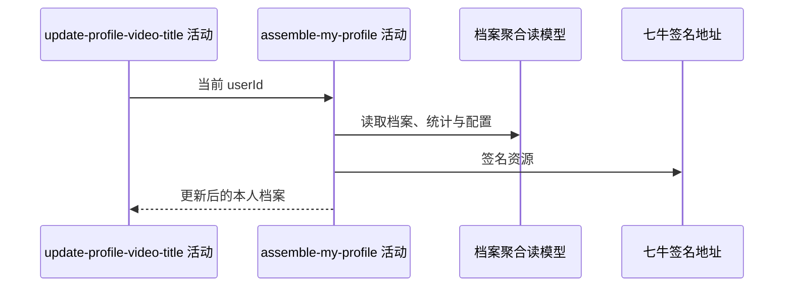

## 概要

重新读取标题更新后的本人档案并组装聚合返回。

## 时序图

## 触发条件

上游档案保存后、同一事务提交前执行。

## 活动契约

入参为当前用户；按档案状态返回与“我的档案”一致的基础或完整聚合结果。活动只读，失败会回滚标题保存。

## 异常分支

| 错误标识 | 触发条件 | 处理 |
|---|---|---|
| `TOKEN_INVALID` | 重新读取不到用户 | 回滚标题保存 |
| `SYSTEM_ERROR` | 城市、统计、评分、配置、签名或封面处理失败 | 回滚标题保存 |

## 领域依赖

无

## 业务动作

A1 读取并判定档案状态
A2 组装基础与完整分组
A3 展示更新后的视频标题

## 详细流程

1. 重新读取用户与档案；`NONE/TBC` 只返回状态和基础资料。
2. `NORMAL/UNDER_REVIEW` 统计关系和完成约球，计算等级、评分，并组装全部视频及展示限制。
3. 视频与封面生成一小时地址；持久化 title 为空白时展示“未命名”。
4. 任一聚合失败向上传播，使同一事务中的标题更新回滚。

## 边界情况

- TBC 下响应不展示已更新标题。
- 无命中仍会执行本聚合，也可能因读依赖失败而整体失败。
- 存量无扩展名 key 可使封面构造失败。

## 实现提示

只读表列按 DB snapshot 声明；外部资源仅签名，不发生文件写入。
