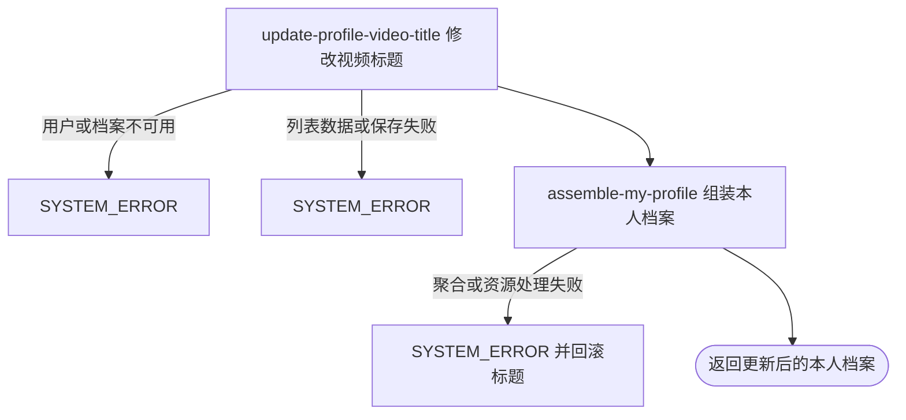

## 概要

修改本人首个同 key 档案视频标题并返回聚合档案。

## 触发

登录用户从档案视频管理入口修改本人某个视频标题时发起。一次请求按 key 处理列表中的首个匹配项；无匹配也返回成功，并交付本人聚合档案。

## 接口契约

### 请求参数

| 字段 | 类型 | 必填 | 约束 |
|---|---|---|---|
| `key` | 字符串 | 是 | 不可为空白；按完整字符串匹配档案视频 |
| `title` | 字符串 | 否 | `null`、空串、纯空白均可，原样保存 |

### 成功响应

返回与“我的档案”同结构的聚合结果。`TBC` 只返回状态与基础资料；`NORMAL`、`UNDER_REVIEW` 返回完整视频列表，持久化标题为空白时展示为“未命名”。响应不说明是否命中或修改了哪一项。

## 业务活动

- update-profile-video-title  查找首个同 key 视频并保存新标题
- assemble-my-profile  重新读取并组装修改后的本人聚合档案

## 流程图

## 详细流程

1. 接收非空白视频 key 和可选新标题，识别当前用户并读取基础用户与网球档案；基础用户不存在按无效身份拒绝，无网球档案时无法修改且不自动建立。
2. 视频列表为 `null` 时不修改；否则按列表顺序查找首个 key 完全相同的视频并把标题原样替换。目标不存在时不修改，重复 key 只改第一项；标题为 `null`、空串或空白也照常保存。
3. 若在目标之前遇到列表项为 `null`，或其 key 为 `null`，比较时可能异常并终止；不清洗存量列表。
4. 保存完整网球档案，保持视频 key、其他视频、档案状态、NTRP、评分和核查信息不变；无命中也执行保存并继续成功。
5. 在同一事务内重新聚合本人档案。`TBC` 只返回状态与基础资料；`NORMAL`、`UNDER_REVIEW` 返回统计、等级、评分和全部视频，空白标题展示为“未命名”。
6. 聚合所需城市、配置、统计、资源签名或视频封面处理失败会回滚标题修改；不上传、替换或删除七牛文件。

## 异常分支

| 对外失败码 | 触发条件 | 由哪个活动报出 | 补偿动作或超时处理 | 对外提示 |
|---|---|---|---|---|
| 请求校验失败 | `key` 未提交或为空白 | 流程 | 不修改档案 | key: 视频 key 不能为空 |
| `TOKEN_INVALID` | 当前登录身份没有基础用户 | update-profile-video-title | 不创建用户或档案 | 登录凭证无效，请重新登录 |
| `SYSTEM_ERROR` | 有用户但没有网球档案 | update-profile-video-title | 不自动建档 | 系统异常，请稍后重试 |
| `SYSTEM_ERROR` | 视频 JSON 无法解析，遍历先遇到 `null` 项或 `null` key，档案保存失败 | update-profile-video-title | 事务回滚标题修改 | 系统异常，请稍后重试 |
| `SYSTEM_ERROR` | 城市、统计、评分、配置、视频封面或资源签名聚合失败 | assemble-my-profile | 事务回滚标题修改 | 系统异常，请稍后重试 |

目标 key 不存在、视频列表为 `null` 或空列表、标题为空白都不是业务异常；无命中时仍可能因返回聚合依赖失败而整体失败。

## 技术线索

- HTTP 接口：`POST /user/profile/video/update`
- 事务入口：`ProfileAppService.updateVideo`
- 查找行为：`stream().filter(v -> v.getKey().equals(key)).findFirst()`
- 标题更新：只对首个命中项 `setTitle`
- 持久化：完整 `videos` 列表 JSON
- 返回聚合：同步调用 `MyProfileAppService.getMyProfile`
- 外部资源：不修改七牛文件；响应签名有效期 3600 秒
