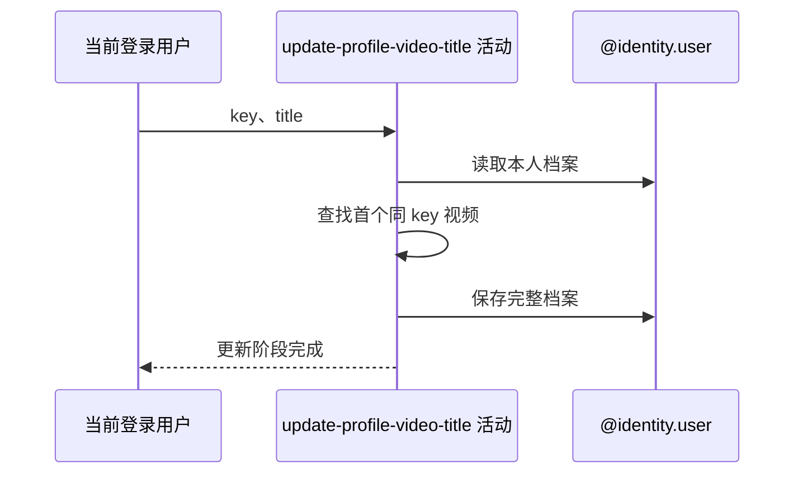

## 概要

在本人档案视频列表中查找首个同 key 项，原样保存新标题。

## 时序图

## 触发条件

`POST /user/profile/video/update` 的 key 通过非空白校验后执行。

## 活动契约

入参为当前用户、非空白 key 和可为 null/空白的 title；仅首个完全匹配项替换标题，无命中也保存并成功进入聚合。

## 异常分支

| 错误标识 | 触发条件 | 处理 |
|---|---|---|
| `TOKEN_INVALID` | 基础用户不存在 | 不创建资料 |
| `SYSTEM_ERROR` | 无网球档案、视频 JSON/空项遍历或保存失败 | 回滚标题修改 |

## 领域依赖

### @identity.user

- 输入：当前用户、目标 key 与新标题
- 输出：保存首个匹配项更新后的完整档案，或业务失败

## 业务动作

A1 读取本人档案视频列表
A2 修改首个匹配标题
A3 保存完整档案

## 详细流程

1. `A1` 读取基础用户和网球档案；用户不存在报 `TOKEN_INVALID`，有用户无档案会失败，不初始化。
2. videos 为 null 时不修改；否则按顺序用 `video.key.equals(key)` 找首个匹配项。
3. `A2` 命中时把 title 原样写入，null、空串和纯空白均允许；重复 key 只改第一项，无命中不报错。
4. `A3` 保存完整档案，保持视频 key、其他视频和非视频字段不变；无命中也执行保存。

## 边界情况

- 目标之前出现 null 视频项或 null key 时，比较可能异常。
- 空白标题在持久化中保留，查询展示为“未命名”。
- 活动不上传、替换或删除外部文件。

## 实现提示

写入通过 `@identity.user` 表达，`reads` 为空；当前行为未返回是否命中。
