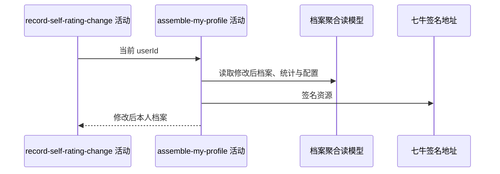

## 概要

重新读取自评修改后的本人档案并组装聚合返回。

## 时序图

## 触发条件

档案与必需日志保存后、同一事务提交前执行。

## 活动契约

入参为当前用户；返回与“我的档案”一致的聚合结果。活动只读，但失败会回滚档案和日志。

## 异常分支

| 错误标识 | 触发条件 | 处理 |
|---|---|---|
| `TOKEN_INVALID` | 重新读取不到用户 | 回滚本次修改和日志 |
| `SYSTEM_ERROR` | 城市、统计、评分、配置、视频或签名处理失败 | 回滚本次修改和日志 |

## 领域依赖

无

## 业务动作

A1 读取修改后档案状态
A2 组装基础资料
A3 组装等级提示、评分、统计和视频

## 详细流程

1. 重新读取本人档案；`TBC` 且未触发核查时只返回基础资料。
2. `NORMAL/UNDER_REVIEW` 返回新 NTRP、冷却或核查提示、统计、评分和完整视频。
3. 因仓储未写新 `review_remaining_matches`，触发核查后的响应可能缺少可靠剩余场次，提示与可修改性据持久化值计算。
4. 任一聚合失败向上传播，整个事务中的档案更新及两类日志一并回滚。

## 边界情况

- 同值修改的响应会看到刷新后的冷却起点。
- TBC 若因大幅上调触发核查，状态会变为 UNDER_REVIEW 并返回完整分组。
- 配置非法整数按 0 降级，可能使提示失真。

## 实现提示

精确只读表列按 DB snapshot 声明；返回不交付变更日志或实际阈值。
