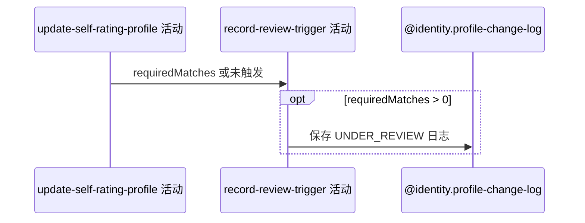

## 概要

仅在自评涨幅达到阈值时，记录核查期触发日志。

## 时序图

## 触发条件

上游计算结果 `requiredMatches > 0` 时执行；未触发则跳过。

## 活动契约

入参为当前用户和所需核查场次；保存一条触发日志，前后值均为所需场次、原因为 USER、备注固定。无业务返回。

## 异常分支

| 错误标识 | 触发条件 | 处理 |
|---|---|---|
| `SYSTEM_ERROR` | 日志业务编号生成、插入或事务处理失败 | 终止并回滚全部自评修改 |

## 领域依赖

### @identity.profile-change-log

- 输入：用户、UNDER_REVIEW 类型、所需场次与触发说明
- 输出：持久化触发日志或失败

## 业务动作

A1 构造核查触发日志
A2 持久化日志

## 详细流程

1. 仅 `requiredMatches > 0` 进入本活动，其他修改不写此类日志。
2. 构造 `type=UNDER_REVIEW`、before/after=所需场次、`reason=USER`、remark=“自评向上修改触发核查期”，refId 为空。
3. 当前 Java 在档案仓储更新之前插入本日志，但处于同一事务；后续失败会一并回滚。

## 边界情况

- requiredMatches 配置为 0 时，即使差额达到阈值也因返回值不大于 0 而不写日志。
- 日志 type 按大写枚举名保存；后续查询却使用小写 `under_review`，可能查不到。
- refId 为空参与唯一约束时的数据库 null 语义不提供幂等保证。

## 实现提示

写入通过 `@identity.profile-change-log` 表达，`reads` 为空；领域骨架仅登记，未在 activity 阶段设计。
