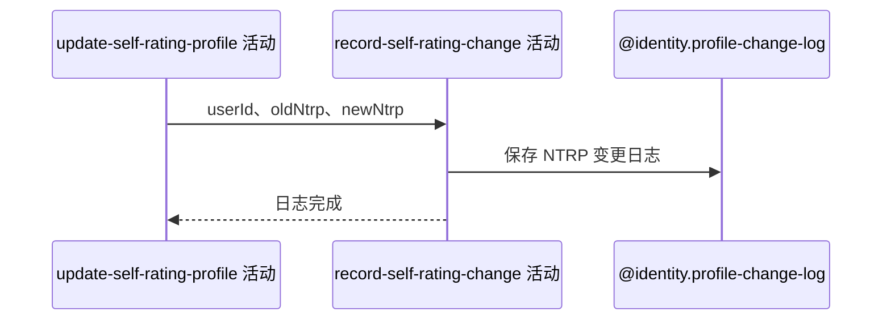

## 概要

记录每次自评修改的旧值、新值、差额与用户手动原因。

## 时序图

## 触发条件

档案更新成功后始终执行；无论是否触发核查、升降或同值。

## 活动契约

入参为用户、修改前与修改后 NTRP；保存一条 `NTRP` 日志，差额旧值非 null 时为 new-old，否则为 0。无业务返回。

## 异常分支

| 错误标识 | 触发条件 | 处理 |
|---|---|---|
| `SYSTEM_ERROR` | 日志构造、业务编号生成或插入失败 | 回滚档案更新和可选触发日志 |

## 领域依赖

### @identity.profile-change-log

- 输入：用户、NTRP 前后值、差额与 USER 原因
- 输出：持久化变更日志或失败

## 业务动作

A1 计算日志差额
A2 保存 NTRP 变更日志

## 详细流程

1. `A1` 旧值存在时计算 `new-old`，旧值为空时差额固定为 0。
2. `A2` 保存 type=NTRP、before=旧值、after=新值、value=差额、reason=USER，remark/refId 为空。
3. 同值提交仍保存零差额日志；降低保存负差额。
4. 任一日志失败使同事务中的档案和核查触发日志回滚。

## 边界情况

- 没有 refId，因此日志唯一约束中的 null 不保证重复请求幂等。
- 日志成功不单独返回给客户端。
- 该活动不重新计算或改变档案值。

## 实现提示

写入通过 `@identity.profile-change-log` 表达，`reads` 为空；本日志在档案仓储更新之后写入。
