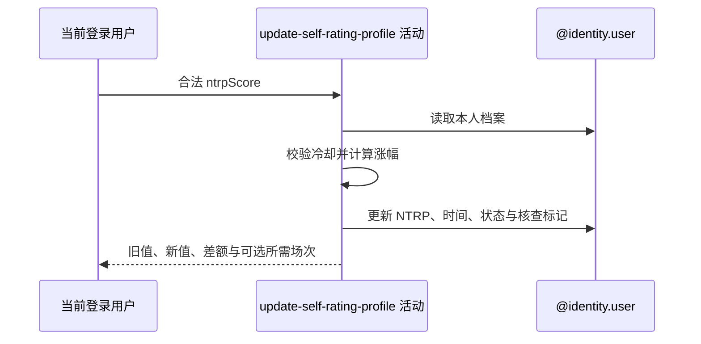

## 概要

校验自评冷却，计算涨幅并更新 NTRP、时间及可选核查状态。

## 时序图

## 触发条件

`PUT /user/profile/ntrp` 的数值通过 1.5～7.0、步长 0.5 校验后执行。

## 活动契约

入参为当前用户和新 NTRP；输出旧值、新值、差额及可选核查所需场次。冷却通过后总会刷新修改时间，同值也视为修改。

## 异常分支

| 错误标识 | 触发条件 | 处理 |
|---|---|---|
| `TOKEN_INVALID` | 基础用户不存在 | 不创建资料 |
| `NTRP_COOLDOWN` | 距上次修改整日数不足当前档位天数 | 不改档案、不写日志 |
| `SYSTEM_ERROR` | 无档案、阈值配置或档案持久化失败 | 整体事务回滚 |

## 领域依赖

### @identity.user

- 输入：当前用户、新自评和冷却/核查配置
- 输出：更新后的网球档案及变更上下文，或业务失败

## 业务动作

A1 校验可信度分档冷却
A2 计算涨幅并决定核查期
A3 更新 NTRP 与修改时间
A4 持久化档案状态

## 详细流程

1. 读取本人档案；无基础用户报 `TOKEN_INVALID`，有用户无档案失败且不补建。
2. `A1` 从 `ntrp_updated_at` 到当前计算整日差；可信度 null/<30、30～59、>=60 分别取低中高冷却配置，不足时报剩余天数。
3. `A2` 差额为新值减旧值；旧值 null 时固定 0。差额达到配置阈值时在内存设 `status=UNDER_REVIEW`、核查标记=true、剩余场次=配置值；否则不触发也不解除既有核查。
4. 触发决定供条件日志活动使用。当前 Java 顺序是先写核查触发日志，再执行 `A3-A4`：设置新 NTRP、`ntrp_updated_at=now` 并更新档案。
5. 仓储只持久化 NTRP、修改时间、状态和核查标记，未写 `review_remaining_matches`。

## 边界情况

- 同值、降低或小幅上调在冷却通过后都刷新冷却起点。
- 整数配置非法按 0 降级，可能跳过冷却或产生零所需场次；小数阈值非法会失败。
- 已在核查期时，未触发的新修改不会解除核查。

## 实现提示

写入通过 `@identity.user` 表达，`reads` 为空；`review_remaining_matches` 的持久化缺口必须保留为已知事实。
